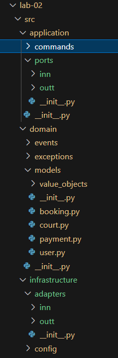

p align="center">Министерство образования Республики Беларусь</p>
<p align="center">Учреждение образования</p>
<p align="center">"Брестский Государственный технический университет"</p>
<p align="center">Кафедра ИИТ</p>
<br><br><br><br><br><br>
<p align="center"><strong>Лабораторная работа №2</strong></p>
<p align="center"><strong>По дисциплине:</strong> "Проектирование интернет-систем"</p>
<p align="center"><strong>Тема:</strong> "Гексагональная архитектура: проектирование портов и адаптеров"</p>
<br><br><br><br><br><br>
<p align="right"><strong>Выполнил:</strong></p>
<p align="right">Студент 3 курса</p>
<p align="right">Группы ПО-13</p>
<p align="right">Куликовская А. В.</p>
<p align="right"><strong>Проверил:</strong></p>
<p align="right">Шорох Д.В.</p>
<br><br><br><br><br>
<p align="center"><strong>Брест 2026</strong></p>

---

## Цель работы

Спроектировать архитектуру основного сервиса системы с использованием гексагональной (hexagonal) архитектуры: создать структуру проекта, определить порты (интерфейсы) и продемонстрировать изоляцию слоёв через минимальные примеры.

---

## Вариант №51 - Бронь манежа "Свободна площадка?" 🏸🏀🏐🏓

**Питч:** забронируй нужную площадку для игры.

**Ядро домена:** Площадки, Расписание, Брони, Отмены

**Выбранный сервис:** Booking Service

---

## Ход выполнения работы

### Часть 1. Архитектурная диаграмма

**Описание сервиса:** Booking Service управляет жизненным циклом бронирования спортивных площадок: поиск площадок, просмотр расписания, создание бронирований и управление отзывами пользователей.Основные сущности: Court (Площадка), Schedule (Расписание), Booking (Бронь), Review (Отзыв).

**Диаграмма слоёв:**

```
┌───────────────────────────────────────────────────────────────────────────────┐
│                             ВНЕШНИЙ МИР                                       │
│  ┌─────────────┐  ┌─────────────┐  ┌───────────────┐  ┌─────────────────────┐ │
│  │   Web UI    │  │  Admin Panel│  │Payment Gateway│  │Notification Service │ │
│  │  (React)    │  │   (React)   │  │  (YooKassa)   │  │  (Email/SMS)        │ │
│  └──────┬──────┘  └──────┬──────┘  └───────┬───────┘  └──────────┬──────────┘ │
└─────────┼────────────────┼─────────────────┼─────────────────────┼────────────┘
          │                │                 │                     │
          ▼                ▼                 ▼                     ▼
┌───────────────────────────────────────────────────────────────────────────────┐
│                      INFRASTRUCTURE LAYER (Адаптеры)                          │
│                                                                               │
│  ┌─────────────────────────────────┐    ┌─────────────────────────────────┐   │
│  │      ВХОДЯЩИЕ АДАПТЕРЫ          │    │      ИСХОДЯЩИЕ АДАПТЕРЫ         │   │
│  │  ┌─────────────────────────┐    │    │  ┌─────────────────────────┐    │   │
│  │  │  BookingController      │◄───┼────┼──┤  BookingRepository      │    │   │
│  │  │  (REST API)             │    │    │  │  (PostgreSQL)           │    │   │
│  │  └─────────────────────────┘    │    │  └─────────────────────────┘    │   │
│  │  ┌─────────────────────────┐    │    │  ┌─────────────────────────┐    │   │
│  │  │  AdminController        │◄───┼────┼──┤  CourtRepository        │    │   │
│  │  │  (REST API)             │    │    │  │  (PostgreSQL)           │    │   │
│  │  └─────────────────────────┘    │    │  └─────────────────────────┘    │   │
│  │  ┌─────────────────────────┐    │    │  ┌─────────────────────────┐    │   │
│  │  │ PaymentWebhookController│◄───┼────┼──┤  ScheduleRepository     │    │   │
│  │  │  (REST API)             │    │    │  │  (Redis/PostgreSQL)     │    │   │
│  │  └─────────────────────────┘    │    │  └─────────────────────────┘    │   │
│  │                                 │    │  ┌─────────────────────────┐    │   │
│  │                                 │    │  │  PaymentGatewayClient   │───►│   │
│  │                                 │    │  │  (HTTP Client)          │    │   │
│  │                                 │    │  └─────────────────────────┘    │   │
│  │                                 │    │  ┌─────────────────────────┐    │   │
│  │                                 │    │  │  NotificationClient     │───►│   │
│  │                                 │    │  │  (HTTP Client)          │    │   │
│  │                                 │    │  └─────────────────────────┘    │   │
│  └─────────────────────────────────┘    └─────────────────────────────────┘   │
│                               ▲                                   ▲           │
│                               │                                   │           │
│                               └───────────────────┬───────────────┘           │
│                                                   │                           │
└───────────────────────────────────────────────────┼───────────────────────────┘
                                                    │
                                                    ▼
┌────────────────────────────────────────────────────────────────────────────────────────┐
│                                 APPLICATION LAYER (Порты)                              │
│                                                                                        │
│  ┌───────────────────────────────────────┐    ┌──────────────────────────────────────┐ │
│  │   ВХОДЯЩИЕ ПОРТЫ (Интерфейсы)         │    │   ИСХОДЯЩИЕ ПОРТЫ (Интерфейсы)       │ │
│  │                                       │    │                                      │ │
│  │  interface IBookingService {          │    │  interface IBookingRepository {      │ │
│  │    createBooking(cmd): BookingId      │    │    save(booking): void               │ │
│  │    cancelBooking(id): void            │    │    findById(id): Booking             │ │
│  │    getBooking(id): BookingDTO         │    │    findByUser(userId): List          │ │
│  │    listAvailableSlots(): List         │    │    findActiveByCourt(court,          │ │
│  │  }                                    │    │                         date)        │ │
│  │                                       │    │  }                                   │ │
│  │  interface IAdminService {            │    │                                      │ │
│  │    createPhoneBooking(cmd): BookingId │ interface ICourtRepository {              │ │
│  │    confirmPayment(id): void           │    │    findById(id): Court               │ │
│  │  }                                    │    │    findByType(type): List            │ │
│  │                                       │    │    findAll(): List                   │ │
│  │  interface IPaymentService {          │    │  }                                   │ │
│  │    processPayment(cmd): Result        │    │                                      │ │
│  │    verifyPayment(id): Status          │    │  interface IScheduleRepository{      │ │
│  │  }                                    │    │    isAvailable(court, slot): bool    │ │
│  │                                       │    │    lockSlot(court, slot): bool       │ │
│  │                                       │    │    unlockSlot(court, slot): void     │ │
│  │                                       │    │    confirmSlot(court, slot): void    │ │
│  │                                       │    │  }                                   │ │
│  │                                       │    │                                      │ │
│  │                                       │    │  interface IPaymentGateway {         │ │
│  │                                       │    │    charge(amount, currency): Result  │ │
│  │                                       │    │    refund(paymentId): Result         │ │
│  │                                       │    │    getStatus(paymentId): Status      │ │
│  │                                       │    │  }                                   │ │
│  │                                       │    │                                      │ │
│  │                                       │    │  interface INotificationService{     │ │
│  │                                       │    │    sendBookingConfirmation(to,       │ │
│  │                                       │    │                              booking)│ │
│  │                                       │    │    sendReminder(to, booking): void   │ │
│  │                                       │    │  }                                   │ │
│  └───────────────────────────────────────┘    └──────────────────────────────────────┘ │
│                                 ▲                                ▲                     │
│                                 │                                │                     │
│                                 └─────────────────┬──────────────┘                     │
│                                                   │                                    │
└───────────────────────────────────────────────────┼────────────────────────────────────┘
                                                    │
                                                    ▼
┌──────────────────────────────────────────────────────────────────────────────┐
│                      DOMAIN LAYER (Ядро)                                     │
│                                                                              │
│  ┌──────────────────────────────────────────────────────────────────────────┐│
│  │                          Entities (Сущности)                             ││
│  │  ┌─────────────┐  ┌─────────────┐  ┌──────────────┐  ┌─────────────────┐ ││
│  │  │   Booking   │  │    Court    │  │     Slot     │  │    Payment      │ ││
│  │  │  (Aggregate)│  │   (Entity)  │  │(Value Object)│  │   (Entity)      │ ││
│  │  │             │  │             │  │              │  │                 │ ││
│  │  │ - id: UUID  │  │ - id: UUID  │  │ - start: Time│  │ - id: UUID      │ ││
│  │  │ - userId    │  │ - name      │  │ - end: Time  │  │ - bookingId     │ ││
│  │  │ - courtId   │  │ - type      │  │ - date: Date │  │ - amount        │ ││
│  │  │ - slot      │  │ - capacity  │  │              │  │ - status        │ ││
│  │  │ - status    │  │ - price     │  │              │  │ - method        │ ││
│  │  │ - payment   │  │ - isActive  │  │              │  │                 │ ││
│  │  │             │  │             │  │              │  │                 │ ││
│  │  │ confirm()   │  │ activate()  │  │  overlaps()? │  │ refund()        │ ││
│  │  │ cancel()    │  │ deactivate()│  │              │  │ confirm()       │ ││
│  │  │ isExpired() │  │             │  │              │  │                 │ ││
│  │  └─────────────┘  └─────────────┘  └──────────────┘  └─────────────────┘ ││
│  │                                                                          ││
│  │  ┌─────────────┐  ┌─────────────┐  ┌──────────────┐  ┌─────────────────┐ ││
│  │  │    User     │  │  CourtType  │  │ BookingStatus│  │  PaymentStatus  │ ││
│  │  │  (Entity)   │  │ (Enum/VO)   │  │   (Enum)     │  │    (Enum)       │ ││
│  │  │             │  │             │  │              │  │                 │ ││
│  │  │ - id        │  │ VOLLEYBALL  │  │ PENDING      │  │ PENDING         │ ││
│  │  │ - email     │  │ BASKETBALL  │  │ RESERVED     │  │ PROCESSING      │ ││
│  │  │ - phone     │  │ BADMINTON   │  │ CONFIRMED    │  │ SUCCESS         │ ││
│  │  │ - role      │  │ TABLE_TENNIS│  │ CANCELLED    │  │ FAILED          │ ││
│  │  │             │  │             │  │ EXPIRED      │  │ REFUNDED        │ ││
│  │  └─────────────┘  └─────────────┘  └──────────────┘  └─────────────────┘ ││
│  │                                                                          ││
│  └──────────────────────────────────────────────────────────────────────────┘│
│                                                                              │
│  ┌──────────────────────────────────────────────────────────────────────────┐│
│  │                      Domain Events (События)                             ││
│  │                                                                          ││
│  │  BookingCreatedEvent    → После создания бронирования                    ││
│  │  BookingConfirmedEvent  → После подтверждения оплаты                     ││
│  │  BookingCancelledEvent  → После отмены                                   ││
│  │  PaymentReceivedEvent   → После получения платежа                        ││
│  │  SlotLockedEvent        → После блокировки слота                         ││
│  │                                                                          ││
│  └──────────────────────────────────────────────────────────────────────────┘│
│                                                                              │
└──────────────────────────────────────────────────────────────────────────────┘

```


### Часть 2. Структура проекта (скелет)

**Технология:** Java

**Структура папок:**

```
lab-02/
├── src/
│   ├── __init__.py
│   ├── domain/
│   │   ├── __init__.py
│   │   ├── models/
│   │   │   ├── __init__.py
│   │   │   ├── booking.py
│   │   │   ├── court.py
│   │   │   ├── user.py
│   │   │   ├── payment.py
│   │   │   └── value_objects/
│   │   │       ├── __init__.py
│   │   │       ├── slot.py
│   │   │       ├── court_type.py
│   │   │       ├── booking_status.py
│   │   │       ├── payment_status.py
│   │   │       └── money.py
│   │   ├── events/
│   │   │   ├── __init__.py
│   │   │   ├── domain_event.py
│   │   │   ├── booking_created.py
│   │   │   ├── booking_confirmed.py
│   │   │   ├── booking_cancelled.py
│   │   │   └── payment_received.py
│   │   └── exceptions/
│   │       ├── __init__.py
│   │       └── domain_exception.py
│   │
│   ├── application/
│   │   ├── __init__.py
│   │   ├── ports/
│   │   │   ├── __init__.py
│   │   │   ├── inn/          
│   │   │   │   ├── __init__.py
│   │   │   │   ├── booking_service.py
│   │   │   │   ├── admin_service.py
│   │   │   │   └── payment_service.py
│   │   │   └── outt/  
│   │   │       ├── __init__.py
│   │   │       ├── booking_repository.py
│   │   │       ├── court_repository.py
│   │   │       ├── schedule_repository.py
│   │   │       ├── user_repository.py
│   │   │       ├── payment_gateway.py
│   │   │       └── notification_service.py
│   │   ├── commands/
│   │   │   ├── __init__.py
│   │   │   ├── create_booking_command.py
│   │   │   ├── cancel_booking_command.py
│   │   │   └── confirm_payment_command.py
│   │   └── services/
│   │       └── __init__.py
│   │
│   └── infrastructure/
│       ├── __init__.py
│       ├── adapters/
│       │   ├── __init__.py
│       │   ├── inn/
│       │   │   ├── __init__.py
│       │   │   ├── booking_controller.py
│       │   │   ├── admin_controller.py
│       │   │   └── payment_webhook_controller.py
│       │   └── outt/
│       │       ├── __init__.py
│       │       ├── in_memory_booking_repository.py
│       │       ├── in_memory_court_repository.py
│       │       ├── in_memory_schedule_repository.py
│       │       ├── in_memory_user_repository.py
│       │       ├── mock_payment_gateway.py
│       │       └── mock_notification_service.py
│       └── config/
│           ├── __init__.py
│           └── dependency_injection.py
│
├── README.md
├── Architecture.md
└── Отчет.md
```

**Скриншот структуры в IDE**:



---

### Часть 3. Domain Layer (Доменный слой)

#### Доменные сущности

**Entity 1**: Court (Площадка)

```python
@dataclass
class Court:
    id: str
    name: str                    # "Волейбольная площадка #1"
    court_type: CourtType        # VOLLEYBALL / BASKETBALL / BADMINTON / TABLE_TENNIS
    description: Optional[str]
    is_active: bool = True       # Доступна для бронирования?
    
    def deactivate(self) -> None: ...
    def activate(self) -> None: ...
```

**Entity 12**: Booking (Бронирование)

```python
@dataclass
class Booking:
    id: str
    user_id: str                 # Кто забронировал
    court_id: str                # Какая площадка
    slot: Slot                   # Когда (дата + время)
    status: BookingStatus        # PENDING_PAYMENT / RESERVED / CONFIRMED / CANCELLED / EXPIRED
    total_amount: Optional[Money]
    payment_id: Optional[str]
    created_by_admin: bool       # True если бронь по телефону
    notes: Optional[str]
    created_at: datetime
    updated_at: datetime
    _events: List[DomainEvent]   # Доменные события
    
    def confirm(self, payment_id: Optional[str]) -> None: ...
    def cancel(self, reason: Optional[str], cancelled_by: Optional[str]) -> None: ...
    def mark_as_reserved(self) -> None: ...
    def expire(self) -> None: ...
```

**Entity 3**: User (Пользователь)

```python
@dataclass
class User:
    id: str
    email: str
    phone: str
    full_name: str
    role: UserRole               # CUSTOMER / ADMIN / MANAGER
    is_active: bool
    
    def is_admin(self) -> bool: ...
```

**Entity 4**: Payment (Платёж)

```python
@dataclass
class Payment:
    id: str
    booking_id: str
    amount: Optional[Money]
    status: PaymentStatus
    external_payment_id: Optional[str]
    paid_at: Optional[datetime]
    created_at: datetime
    
    def mark_as_success(self, external_id: str) -> None: ...
    def mark_as_failed(self, reason: Optional[str]) -> None: ...
    def refund(self) -> None: ...
```

**Value Object 1**: Slot (Временной слот)

```python
@dataclass
class Slot:
    court_id: str
    date: date
    start_time: time      # Например, 18:00
    end_time: time        # Например, 19:00 (всегда start + 1 час)
    
    def overlaps(self, other: 'Slot') -> bool: ...
```

**Value Object 2**: Money (Денежная сумма)

```python
@dataclass(frozen=True)
class Money:
    amount: float
    currency: str = "BYN"  # Белорусский рубль
    
    def add(self, other: 'Money') -> 'Money': ...
    def multiply(self, factor: int) -> 'Money': ...
```

**Value Object 3**: CourtType (Enum)

```python
class CourtType(Enum):
    VOLLEYBALL = ("volleyball", "Волейбольная площадка", 35)      # 1 шт, 35 BYN/час
    BASKETBALL = ("basketball", "Баскетбольная площадка", 35)     # 1 шт, 35 BYN/час
    BADMINTON = ("badminton", "Бадминтонный корт", 25)            # 8 шт, 25 BYN/час
    TABLE_TENNIS = ("table_tennis", "Стол для настольного тенниса", 15)  # 6 шт, 15 BYN/час
```

**Доменные исключения:**
- DomainException — базовое исключение
- SlotNotAvailableException — слот уже занят
- PaymentRequiredException — требуется оплата
- BookingNotFoundException — бронирование не найдено
- InvalidBookingStatusException — недопустимый статус


#### Бизнес-правила
1.Нельзя создать бронь без указания площадки и времени
2. Слот длится ровно 1 час (валидация в Slot.__post_init__)
3. Нельзя забронировать задним числом (проверка в Application Layer)
4. Для online-бронирования минимум 30 минут до начала слота
5. Отмена возможна не позднее чем за 2 часа до начала (кроме администраторов)
6. Статус бронирования определяет доступные операции (state machine)
---

## Часть 4. Application Layer (Прикладной слой)

#### Входящие порты (Inbound Ports)

Интерфейсы, которые предоставляет система внешнему миру:

**IBookingService**:
```python
class IBookingService(ABC):
    @abstractmethod
    def create_booking(self, command: CreateBookingCommand) -> str: ...
    
    @abstractmethod
    def cancel_booking(self, command: CancelBookingCommand) -> None: ...
    
    @abstractmethod
    def get_booking(self, booking_id: str) -> Optional[Booking]: ...
    
    @abstractmethod
    def list_user_bookings(self, user_id: str) -> List[Booking]: ...
    
    @abstractmethod
    def confirm_payment(self, booking_id: str, payment_id: str) -> None: ...
```

**IAdminService**:
```python
class IAdminService(ABC):
    @abstractmethod
    def create_phone_booking(self, command: CreateBookingCommand, 
                            customer_name: str, customer_phone: str) -> str: ...
    
    @abstractmethod
    def cancel_any_booking(self, booking_id: str, reason: str) -> None: ...
    
    @abstractmethod
    def get_all_bookings(self, date: Optional[str] = None) -> List[Booking]: ...
    
    @abstractmethod
    def block_slot(self, court_id: str, date: str, start_time: str, 
                   reason: str) -> None: ...
```

**IPaymentService**:
```python
class IPaymentService(ABC):
    @abstractmethod
    def process_payment(self, booking_id: str, amount: float, 
                        currency: str) -> str: ...
    
    @abstractmethod
    def verify_payment(self, payment_id: str) -> bool: ...
    
    @abstractmethod
    def refund_payment(self, payment_id: str, 
                       amount: Optional[float] = None) -> bool: ...
```

#### Исходящие порты (Inbound Ports)

Интерфейсы, через которые система взаимодействует с внешним миру:

**IBookingRepository**:
```python
class IBookingRepository(ABC):
    @abstractmethod
    def save(self, booking: Booking) -> None: ...
    
    @abstractmethod
    def find_by_id(self, booking_id: str) -> Optional[Booking]: ...
    
    @abstractmethod
    def find_by_user_id(self, user_id: str) -> List[Booking]: ...
    
    @abstractmethod
    def find_by_court_and_date(self, court_id: str, date: date) -> List[Booking]: ...
    
    @abstractmethod
    def find_active_by_slot(self, court_id: str, date: date, 
                           start_time: time) -> Optional[Booking]: ...
```

**ICourtRepository**:
```python
class ICourtRepository(ABC):
    @abstractmethod
    def save(self, court: Court) -> None: ...
    
    @abstractmethod
    def find_by_id(self, court_id: str) -> Optional[Court]: ...
    
    @abstractmethod
    def find_by_type(self, court_type: CourtType) -> List[Court]: ...
    
    @abstractmethod
    def find_all_active(self) -> List[Court]: ...
```

**IScheduleRepository**:
```python
class IScheduleRepository(ABC):
    @abstractmethod
    def is_available(self, court_id: str, date: date, 
                     start_time: time) -> bool: ...
    
    @abstractmethod
    def lock_slot(self, court_id: str, date: date, start_time: time,
                  booking_id: str, ttl_minutes: int = 10) -> bool: ...
    
    @abstractmethod
    def unlock_slot(self, court_id: str, date: date, 
                    start_time: time) -> None: ...
    
    @abstractmethod
    def confirm_slot(self, court_id: str, date: date, 
                     start_time: time) -> None: ...
    
    @abstractmethod
    def get_available_slots(self, court_id: str, date: date) -> List[Slot]: ...
```


**IPaymentGateway**:
```python
class IPaymentGateway(ABC):
    @abstractmethod
    def charge(self, amount: float, currency: str, description: str,
               idempotency_key: str) -> PaymentResult: ...
    
    @abstractmethod
    def refund(self, payment_id: str, 
               amount: Optional[float] = None) -> PaymentResult: ...
    
    @abstractmethod
    def get_status(self, payment_id: str) -> PaymentStatus: ...
```


**INotificationService**:
```python
class INotificationService(ABC):
    @abstractmethod
    def send_booking_confirmation(self, to_email: str, to_phone: Optional[str],
                                  booking_id: str, court_name: str,
                                  slot_date: str, slot_time: str,
                                  qr_code: Optional[str] = None) -> bool: ...
    
    @abstractmethod
    def send_payment_reminder(self, to_email: str, booking_id: str,
                              hours_left: int) -> bool: ...
    
    @abstractmethod
    def send_cancellation_notice(self, to_email: str, booking_id: str,
                                 reason: Optional[str]) -> bool: ...
    
    @abstractmethod
    def send_sms(self, to_phone: str, message: str) -> bool: ...
```

---

### Часть 5. Infrastructure Layer (Инфраструктурный слой)

#### Входящий адаптер: REST API

**BookingController**:

```python
class BookingController:
    def __init__(self, booking_service: IBookingService):
        self._service = booking_service
    
    def create_booking(self, request: CreateBookingRequest, 
                       user_id: str) -> dict: ...  # POST /api/bookings
    
    def get_booking(self, booking_id: str) -> dict: ...  # GET /api/bookings/{id}
    
    def cancel_booking(self, booking_id: str, user_id: str) -> dict: ...  # DELETE /api/bookings/{id}
```

**Эндпоинты:**
- `POST /api/bookings` - создание брони
- `GET /api/bookings/{id}` - получение брони
- `DELETE /api/bookings/{id}` - отмена брони

**Пример запроса/ответа**:

```json
POST /api/bookings
{
  "court_id": "court-bd-03",
  "date": "2025-03-15",
  "start_time": "18:00",
  "end_time": "19:00",
  "payment_method": "online"
}

Ответ:
{
  "booking_id": "550e8400-e29b-41d4-a716-446655440000"
}
```

#### Исходящий адаптер: Repository

**InMemoryBookingRepository**:
```python
class InMemoryBookingRepository(IBookingRepository):
    def __init__(self):
        self._storage: Dict[str, Booking] = {}
    
    def save(self, booking: Booking) -> None:
        self._storage[booking.id] = booking
    
    def find_by_id(self, booking_id: str) -> Optional[Booking]:
        return self._storage.get(booking_id)
    
    def find_by_user_id(self, user_id: str) -> List[Booking]:
        return [b for b in self._storage.values() if b.user_id == user_id]
    
    def find_by_court_and_date(self, court_id: str, date: date) -> List[Booking]:
        return [
            b for b in self._storage.values() 
            if b.court_id == court_id and b.slot.date == date
        ]
    
    def find_active_by_slot(self, court_id: str, date: date, 
                           start_time: time) -> Optional[Booking]:
        for booking in self._storage.values():
            if (booking.court_id == court_id and 
                booking.slot.date == date and 
                booking.slot.start_time == start_time and
                booking.status.value not in ('cancelled', 'expired')):
                return booking
        return None
```

**InMemoryCourtRepository**:
```python
class InMemoryCourtRepository(ICourtRepository):
    def __init__(self):
        self._storage: Dict[str, Court] = {}
        self._init_default_courts()
    
    def _init_default_courts(self):
        courts = [
            Court("court-vb-01", "Волейбольная площадка #1", CourtType.VOLLEYBALL),
            Court("court-bb-01", "Баскетбольная площадка #1", CourtType.BASKETBALL),
            *[Court(f"court-bd-{i:02d}", f"Бадминтонный корт #{i}", CourtType.BADMINTON) 
              for i in range(1, 9)],
            *[Court(f"court-tt-{i:02d}", f"Стол для настольного тенниса #{i}", CourtType.TABLE_TENNIS) 
              for i in range(1, 7)],
        ]
        for court in courts:
            self.save(court)
```

### Часть 6. Dependency Injection (Конфигурация зависимостей)

**DIContainer:**

```python
class DIContainer:
    def __init__(self):
        # Outgoing Adapters (реализации портов)
        self.booking_repository = InMemoryBookingRepository()
        self.court_repository = InMemoryCourtRepository()
        self.schedule_repository = InMemoryScheduleRepository()
        self.user_repository = InMemoryUserRepository()
        self.payment_gateway = MockPaymentGateway(failure_rate=0.1)
        self.notification_service = MockNotificationService()
        
        # TODO: Lab #4 - создать Application Services
        # self.booking_service = BookingServiceImpl(...)
        # self.admin_service = AdminServiceImpl(...)
        
        # TODO: Lab #4 - создать Incoming Adapters
        # self.booking_controller = BookingController(self.booking_service)
```

**Как работает DI**:
Создаются бины (компоненты) репозиториев и внешних сервисов.


### Часть 7. Тестирование

#### Юнит-тесты для  Booking (Domain)

```python
def test_create_booking_success():
    slot = Slot(
        court_id="court-bd-01",
        date=date(2025, 3, 15),
        start_time=time(18, 0),
        end_time=time(19, 0)
    )
    
    booking = Booking(
        user_id="user-123",
        court_id="court-bd-01",
        slot=slot,
        total_amount=Money(25.0, "BYN")
    )
    
    assert booking.status == BookingStatus.PENDING_PAYMENT
    assert booking.id is not None

def test_slot_duration_must_be_one_hour():
    with pytest.raises(DomainException):
        Slot(
            court_id="court-bd-01",
            date=date(2025, 3, 15),
            start_time=time(18, 0),
            end_time=time(20, 0)  # 2 часа - ошибка!
        )

def test_booking_confirm_success():
    booking = create_test_booking()
    
    booking.confirm(payment_id="PAY-123")
    
    assert booking.status == BookingStatus.CONFIRMED
    assert booking.payment_id == "PAY-123"
```
**Что тестируется**:
- ✅ Успешное создание брони
- ✅ Валидация длительности слота (ровно 1 час)
- ✅ Подтверждение брони после оплаты
- ✅ Генерация доменных событий


## 3. Архитектурная диаграмма

### Диаграмма слоёв
```
┌───────────────────────────────────────────────────────────────────────────────┐
│                     Infrastructure Layer                                      │
│  ┌───────────────────────────┐  ┌─────────────────────────────────────────┐   │
│  │ REST API Controllers      │  │ Repositories / External Services        │   │
│  │ (inn/)                    │  │ (outt/)                                 │   │
│  │ • BookingController       │  │ • InMemoryBookingRepository             │   │
│  │ • AdminController         │  │ • InMemoryCourtRepository               │   │
│  │ • PaymentWebhookController│  │ • InMemoryScheduleRepository            │   │
│  └───────────┬───────────────┘  │ • MockPaymentGateway                    │   │
│              │                  │ • MockNotificationService               │   │
│              │                  └─────────────────────────────────────────┘   │
└──────────────┼────────────────────────────────────────────────────────────────┘
               │
               ▼
┌─────────────────────────────────────────────────────────────────────────────┐
│                     Application Layer                                       │
│  ┌─────────────────────────┐  ┌─────────────────────────────────────────┐   │
│  │ Incoming Ports (inn/)   │  │ Outgoing Ports (outt/)                  │   │
│  │ • IBookingService       │  │ • IBookingRepository                    │   │
│  │ • IAdminService         │  │ • ICourtRepository                      │   │
│  │ • IPaymentService       │  │ • IScheduleRepository                   │   │
│  └───────────┬─────────────┘  │ • IPaymentGateway                       │   │
│              │                │ • INotificationService                  │   │
│  ┌───────────▼─────────────────────────────────────────────────────────┐    │
│  │   Commands (DTO): CreateBookingCommand, CancelBookingCommand, ...   │    │
│  └─────────────────────────────────────────────────────────────────────┘    │
└───────────────────────────┬─────────────────────────────────────────────────┘
                            │
                            ▼
┌─────────────────────────────────────────────────────────────────────────────┐
│                         Domain Layer                                        │
│  ┌──────────────┐  ┌──────────────┐  ┌──────────────┐  ┌──────────────┐     │
│  │ Booking      │  │ Court        │  │ User         │  │ Payment      │     │
│  │ (Aggregate)  │  │ (Entity)     │  │ (Entity)     │  │ (Entity)     │     │
│  │ Root         │  │              │  │              │  │              │     │
│  └──────────────┘  └──────────────┘  └──────────────┘  └──────────────┘     │
│  ┌──────────────┐  ┌──────────────┐  ┌──────────────┐  ┌──────────────┐     │
│  │ Slot         │  │ Money        │  │ CourtType    │  │ BookingStatus│     │
│  │ (Value Obj)  │  │ (Value Obj)  │  │ (Enum)       │  │ (Enum)       │     │
│  └──────────────┘  └──────────────┘  └──────────────┘  └──────────────┘     │
│  ┌─────────────────────────────────────────────────────────────────────┐    │
│  │ Domain Events: BookingCreated, BookingConfirmed, BookingCancelled   │    │
│  └─────────────────────────────────────────────────────────────────────┘    │
└─────────────────────────────────────────────────────────────────────────────┘
```
### Описание портов и адаптеров
| Тип | Название | Назначение |
| --- | --- | --- |
| **Входящий порт** | IBookingService |	Интерфейс для создания/отмены бронирований клиентами
| **Входящий порт** | IAdminService |	Интерфейс для управления бронями администраторами
| **Входящий порт** | IPaymentService	| Интерфейс для обработки платежей
| **Исходящий порт** | IBookingRepository	| Интерфейс для хранения бронирований
| **Исходящий порт** | ICourtRepository	| Интерфейс для доступа к площадкам
| **Исходящий порт** | ICourtRepository | Интерфейс для доступа к площадкам
| **Исходящий порт** | IScheduleRepository | Интерфейс для управления расписанием и блокировкой слотов
| **Исходящий порт** | IPaymentGateway | Интерфейс для интеграции с платёжной системой
| **Исходящий порт** | INotificationService |	Интерфейс для отправки уведомлений
| **Входящий адаптер** | BookingController | REST API для клиентов
| **Входящий адаптер** | AdminController | REST API для администраторов 
| **Входящий адаптер** | PaymentWebhookController	| Webhook от платёжной системы
| **Исходящий адаптер** | InMemoryBookingRepository	| Реализация хранилища броней в памяти
| **Исходящий адаптер** | InMemoryCourtRepository	| Реализация хранилища площадок в памяти
| **Исходящий адаптер** | InMemoryScheduleRepository | Реализация расписания в памяти
| **Исходящий адаптер** | MockPaymentGateway | Имитация платёжного шлюза
| **Исходящий адаптер** | MockNotificationService	| Имитация сервиса уведомлений

---


## 4. Критерии выполнения

| Критерий | Выполнено |
|----------|-----------|
| Структура проекта (domain/application/infrastructure) | ✅ | 
| Domain Layer (чистая бизнес-логика) |  ✅ | 
| Порты (входящие и исходящие интерфейсы) | ✅ |
| Адаптеры (минимум 1 входящий + 2 исходящих) | ✅ | 
| DI-конфигурация (зависимости инжектятся) |  ✅ | 
| Юнит-тесты для BookingService с моками |  ✅ | 
| Документация (диаграмма, описание) | ✅ | 

**Итого**: 7 / 7


## 6. Выводы

### Что получилось хорошо
Удалось чётко разделить доменный слой (Booking, Court, Slot, Money) и инфраструктуру. Domain-модели не содержат зависимостей от FastAPI или SQLAlchemy. Application-сервисы (интерфейсы портов) легко тестируются с моками, так как работают только через абстракции. Структура проекта получилась чистой и соответствует гексагональной архитектуре.
Особенности предметной области (16 площадок, почасовая оплата, online/phone бронирование) хорошо легли в архитектуру: CourtType с ценами, Slot с валидацией 1 часа, BookingStatus с разными путями подтверждения.

### С какими трудностями столкнулись
Первоначально было сложно понять, зачем создавать отдельные интерфейсы для портов, если есть только одна реализация. Также возникли сложности с именованием папок (in/out — зарезервированные слова в Python), пришлось переименовать в inn/outt. Настройка импортов в Python (абсолютные vs относительные) потребовала понимания PYTHONPATH и структуры пакетов.

### Что узнали нового
Узнала, как работает гексагональная архитектура и почему важно отделять бизнес-логику от инфраструктуры. Разобралась в принципе Dependency Inversion: доменный слой не должен зависеть от деталей реализации. Поняла, как порты позволяют легко подменять адаптеры (например, InMemory → PostgreSQL в Lab #5). Освоила базовые принципы DI и поняла, как они помогают тестировать приложение.

### Как можно улучшить
Добавить реальную БД (PostgreSQL) вместо InMemory-репозиториев (Lab #5). Реализовать полноценную проверку доступности площадок с учётом часов работы манежа (08:00-23:00). Добавить интеграционные тесты с TestContainers (Lab #6). Ввести систему уведомлений (email/SMS) и вынести её в отдельный микросервис (Lab #8). Добавить валидацию входных DTO и централизованную обработку ошибок (Lab #4). Реализовать Saga Pattern для распределённых транзакций (бронирование + оплата).
