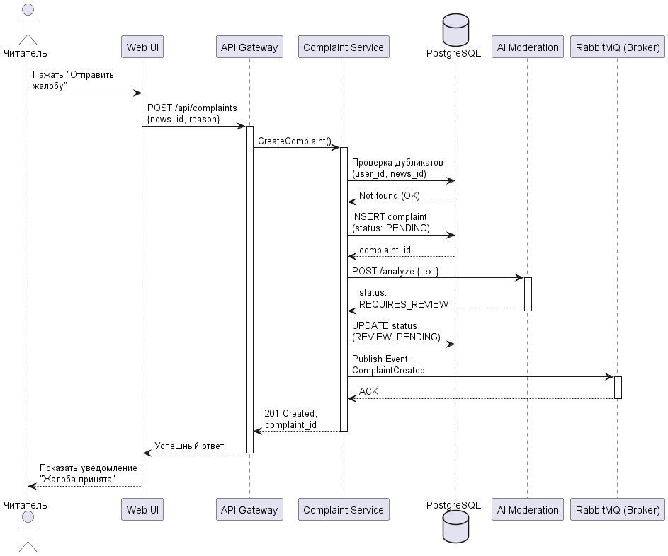
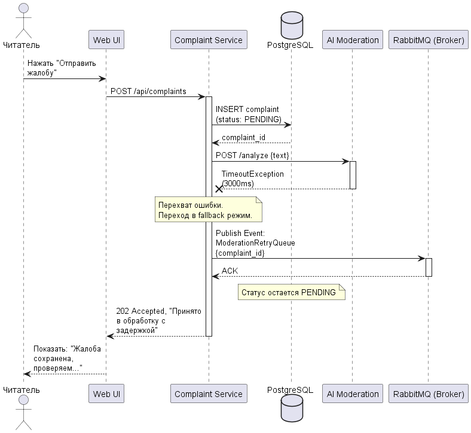

<p align="center">Министерство образования Республики Беларусь</p>
<p align="center">Учреждение образования</p>
<p align="center">"Брестский Государственный технический университет"</p>
<p align="center">Кафедра ИИТ</p>
<br><br><br><br><br><br>
<p align="center"><strong>Лабораторная работа №1</strong></p>
<p align="center"><strong>По дисциплине:</strong> "Проектирование интернет-систем"</p>
<p align="center"><strong>Тема:</strong> "Сценарий транзакции: моделирование use-case и границ ответственности"</p>
<br><br><br><br><br><br>
<p align="right"><strong>Выполнил:</strong></p>
<p align="right">Студент 3 курса</p>
<p align="right">Группы ПО-12</p>
<p align="right">Михновец С. Э.</p>
<p align="right"><strong>Проверил:</strong></p>
<p align="right">Несюк А.Н.</p>
<br><br><br><br><br>
<p align="center"><strong>Брест 2026</strong></p>

---

## Цель работы

Научиться анализировать бизнес-процессы интернет-системы, выявлять границы ответственности компонентов и моделировать транзакционные сценарии с учётом возможных сбоев.

---

## Вариант №37 - Новости «Без фейков» 📰

**Питч:** Читаем умно, делимся быстро.

**Ядро домена:** Источники, Лента, Теги, Избранное, Жалобы.

---

## Ход выполнения работы

### 1. Структура проекта

```text
lab-01/
├── Отчет.md                # Основной отчёт (этот документ)
├── use-case.md             # Текстовое описание use-case
├── diagrams/
│   ├── sequence-happy.puml # PlantUML для успешного сценария
│   ├── sequence-happy.png  # Экспорт диаграммы
│   ├── sequence-error.puml # PlantUML для сценария с ошибкой
│   └── sequence-error.png  # Экспорт диаграммы
├── scenarios.feature       # Gherkin-сценарии
└── analysis.md             # Анализ границ ответственности
```

---

### 2. Use-case описание

👉 **Ссылка на файл:** [use-case.md](use-case.md)

**Основной сценарий:** Подача жалобы на фейковую новость с автоматической проверкой

**Первичный актор:** Авторизованный читатель

**Цель:** Сообщить о недостоверной информации в новости для её последующей проверки и возможной блокировки.

**Краткое описание основного потока:**
1. Пользователь нажимает "Пожаловаться на фейк" и выбирает причину.
2. Система отправляет API-запрос на создание жалобы.
3. Сервис сохраняет жалобу в БД со статусом "PENDING".
4. Система синхронно запрашивает внешний сервис AI-модерации для анализа текста.
5. AI-модерация возвращает статус "REQUIRES_HUMAN_REVIEW".
6. Статус жалобы в БД обновляется.
7. В очередь ставится задача на отправку уведомления модераторам.

**Альтернативные потоки:** 
- AI-модерация на 100% уверена, что это фейк -> Автоматическое скрытие новости из ленты.

**Исключительные ситуации:** 
- Таймаут сервиса AI-модерации (переход в асинхронный режим).
- Пользователь отправляет повторную жалобу на ту же новость (защита от дубликатов).
- Новость была удалена до момента отправки жалобы (404 Not Found).

---

### 3. Диаграммы последовательности (Sequence Diagrams)

#### 3.1. Happy Path (успешный сценарий)

👉 **PlantUML исходник:** [sequence-happy.puml](diagrams/sequence-happy.puml)



**Описание потока:**
- Пользователь отправляет жалобу. `Complaint Service` проверяет БД на дубликаты и сохраняет запись. Затем синхронно вызывается внешний сервис `AI Moderation`. После получения ответа статус обновляется, и публикуется событие в `RabbitMQ` для асинхронного уведомления модераторов.

**Участники:**
- Читатель (User)
- Web UI / API Gateway
- Complaint Service (Сервис жалоб)
- PostgreSQL (База данных)
- AI Moderation (Внешний сервис проверки ИИ)
- RabbitMQ (Брокер сообщений)

#### 3.2. Error Case (сценарий с ошибкой)

👉 **PlantUML исходник:** [sequence-error.puml](diagrams/sequence-error.puml)



**Описание потока:**
- Во время вызова `AI Moderation` происходит таймаут (сервис недоступен или перегружен). `Complaint Service` перехватывает исключение. Вместо того чтобы выдавать ошибку пользователю, жалоба остается в БД в статусе `PENDING`, а задача на проверку отправляется в очередь `RabbitMQ` (Fallback). Пользователь получает статус 202 Accepted.

---

### 4. Gherkin-сценарии

👉 **Ссылка на файл:** [scenarios.feature](scenarios.feature)

**Реализовано сценариев:** 4

**Список сценариев:**
1. ✅ **Успешный сценарий:** Успешная подача жалобы на новость.
2. ✅ **Ошибка:** Новость уже удалена (Not Found).
3. ✅ **Ошибка:** Таймаут сервиса AI-модерации (Fallback в асинхронный режим).
4. ✅ **Ошибка:** Идемпотентность - Защита от двойного клика (Дубликат).

**Пример сценария (Успешный путь):**
```gherkin
Feature: Подача жалобы на фейковую новость

Scenario: Успешная подача жалобы на новость
  Given пользователь авторизован как "reader@example.com"
  And новость "Инопланетяне приземлились" с ID "NEWS-123" существует
  When пользователь отправляет жалобу на "NEWS-123" с причиной "Недостоверный источник"
  And сервис авто-модерации работает корректно
  Then система создает жалобу со статусом "REVIEW_PENDING"
  And система публикует событие "ComplaintCreated" в брокер сообщений
  And пользователь видит сообщение "Ваша жалоба отправлена на проверку модераторам"
```

---

### 5. Анализ границ ответственности

👉 **Ссылка на файл:** [analysis.md](analysis.md)

#### 5.1. Транзакционные границы

| Операция | Синхронная/Асинхронная | Откат при ошибке | Retry-стратегия | Идемпотентность |
|----------|------------------------|------------------|-----------------|-----------------|
| Сохранение жалобы в БД | Синхронная | Да (ROLLBACK) | Нет (контролируется UI) | Да (составной ключ user_id + news_id) |
| Проверка через AI Moderation | Синхронная | Нет (Переход в Async) | Отправка в очередь RabbitMQ с задержкой | Да (Сервис ИИ кэширует хеш текста) |
| Уведомление модераторов (Email)| Асинхронная | Нет (best-effort) | 3 попытки (через брокер сообщений) | Да (дедупликация по complaint_id) |

#### 5.2. Обработка исключительных ситуаций

**Реализовано стратегий обработки:** 2

##### Исключительная ситуация 1: Таймаут сервиса Автомодерации

- **Условие возникновения:** HTTP POST запрос к внешнему сервису ИИ не отвечает более 3 секунд.
- **Обнаружение:** HTTP-клиент (например, Axios) выбрасывает `TimeoutException`.
- **Реакция:** Система ловит ошибку, не откатывает БД. Публикует событие `ModerationRetryQueue` в RabbitMQ для фоновой обработки.
- **Компенсация:** Не требуется откат. Жалоба остается в статусе "PENDING" до успешной асинхронной обработки воркером.
- **Уведомление пользователя:** "Жалоба принята. Из-за высокой нагрузки проверка займет чуть больше времени." (HTTP 202 Accepted).

##### Исключительная ситуация 2: Нарушение уникальности (Double click)

- **Условие возникновения:** Пользователь дважды нажал кнопку "Отправить", сгенерировав два параллельных запроса.
- **Обнаружение:** База данных PostgreSQL выбрасывает `UniqueConstraintViolationException` на составной индекс `(user_id, news_id)`.
- **Реакция:** Транзакция второго запроса прерывается. Система перехватывает ошибку БД.
- **Компенсация:** Откат (ROLLBACK) транзакции второго (дублирующего) запроса.
- **Уведомление пользователя:** Возвращается успешный ответ (HTTP 200) с сообщением: "Вы уже пожаловались на эту новость ранее."

---

## Таблица критериев оценки

| Критерий | Баллы | Выполнено |
|----------|-------|-----------|
| Use-case описание (полнота: акторы, предусловия, основной поток, альтернативы, исключения) | 15 | ✅ |
| Sequence diagram (happy path) - корректность нотации UML, включение всех ключевых компонентов | 20 | ✅ |
| Sequence diagram (error case) - моделирование хотя бы одной исключительной ситуации | 15 | ✅ |
| Gherkin-сценарии - минимум 4 сценария (1 успешный + 3 ошибочных) | 20 | ✅ |
| Анализ границ ответственности - таблица транзакционных границ, обоснование выбора синхронных/асинхронных операций | 15 | ✅ |
| Обработка исключений - описание стратегий retry, компенсации, уведомлений | 10 | ✅ |
| Качество документации - оформление, читаемость, грамотность | 5 | ✅ |
| **ИТОГО** | **100** | |

---

## Контрольные вопросы

**Подготовка к защите:**

1. **Что такое транзакционная граница? Где она проходит в вашем сценарии?**
   - Транзакционная граница — это область системы, в пределах которой набор операций выполняется атомарно (все или ничего). В моем сценарии граница проходит на уровне базы данных Complaint Service: проверка дубликатов и сохранение жалобы со статусом `PENDING` выполняются в одной транзакции. Вызов внешнего сервиса AI вынесен за эту границу, чтобы долгий ответ сети не блокировал подключение к БД.

2. **Почему операция X выбрана синхронной, а Y - асинхронной?**
   - **Синхронная (Запись в БД):** Система должна гарантированно сохранить данные жалобы и вернуть пользователю ответ с ID операции, чтобы он понимал, что запрос не потерян.
   - **Асинхронная (Уведомление модераторов):** Отправка Email может занимать время. Пользователю не нужно ждать на сайте, пока письмо дойдет до модератора. Это можно сделать в фоне.

3. **Как обеспечить идемпотентность при повторных запросах?**
   - Идемпотентность обеспечивается созданием составного уникального индекса в базе данных по полям `user_id` и `news_id`. Если один и тот же пользователь попытается отправить жалобу на одну и ту же новость дважды, БД выбросит ошибку уникальности, которую сервис перехватит и вернет информацию о уже существующей жалобе без создания дубликата.

4. **Что произойдёт, если внешний сервис вернёт ошибку после частичного выполнения операции?**
   - Если сервис AI-модерации упадет после того, как жалоба была записана в БД, система не будет делать откат (rollback) жалобы. Вместо этого сработает паттерн Fallback: жалоба будет помещена в очередь брокера сообщений (RabbitMQ) для повторной попытки (Retry) проверки в фоновом режиме, когда внешний сервис снова станет доступен.

5. **Как система обнаружит, что внешний сервис недоступен?**
   - Через `TimeoutException` (если сервис не ответил за заданное время, например 3 секунды) или при получении HTTP-статусов ошибок из серии `5xx` (Internal Server Error, Bad Gateway). Также может использоваться паттерн Circuit Breaker для мониторинга процента отказов.

6. **Какие данные нужно логировать для диагностики сбоев?**
   - Нужно логировать: `timestamp` (время сбоя), `user_id`, `news_id`, `complaint_id`, текст ошибки (`Exception message` и `Stack Trace`), HTTP-статус ответа от внешнего сервиса, а также время выполнения запроса до падения (duration), чтобы диагностировать проблемы с производительностью сети.

---

## Ссылка на репозиторий

👉 **GitHub:** [[Cсылку на репозиторий]](https://github.com/dizmorall/PIS-2026)

---

## Вывод

✍️ В ходе выполнения лабораторной работы был проанализирован бизнес-процесс платформы "Новости «Без фейков»" на примере сценария модерации контента. Были разработаны текстовые use-case описания и визуальные модели взаимодействия компонентов с использованием инструмента PlantUML. Сформированы Gherkin-сценарии для автоматизированного BDD-тестирования, покрывающие как успешный путь, так и нештатные ситуации. Были определены границы транзакций: выделена критическая секция (запись в БД) и вынесены за её пределы нестабильные внешние вызовы (AI-проверка). Освоены паттерны обеспечения отказоустойчивости интернет-систем, такие как асинхронный Fallback через очереди сообщений и обеспечение идемпотентности API.

---

**Дата выполнения:** 05.03.2026

**Оценка:** _____________

**Подпись преподавателя:** _____________
