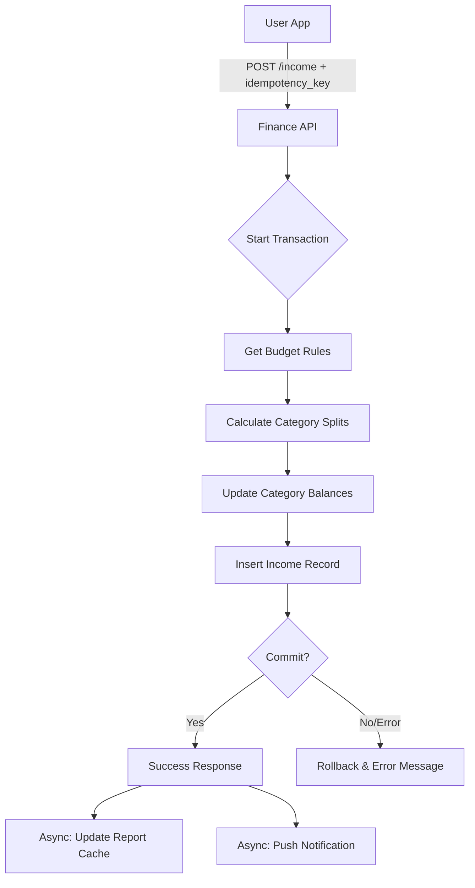

# Анализ границ ответственности

**Система:** Финучёт «Где мои деньги» 💸  
**Сценарий:** Регистрация дохода с автоматическим распределением по категориям

---

## 1. Транзакционные границы

### 1.1. Где начинается и заканчивается транзакция?

**Начало транзакции:** Пользователь нажимает кнопку «Применить» в форме добавления дохода.

**Конец транзакции (успешный сценарий):**
- **Основная транзакция БД №1 (Income Distribution):** Запись о доходе сохранена + Балансы всех задействованных категорий обновлены.
- **Побочные эффекты (асинхронные):** Обновление кэша для графиков отчетов + Push-уведомление о пополнении.

**Важно:** У нас одна критическая транзакция для распределения средств. Если хотя бы одна категория не обновила свой баланс, вся операция «прихода» должна откатиться, иначе возникнет рассогласование (деньги зашли в систему, но не попали в «кошельки»).

### 1.2. Какие операции должны быть атомарными?

#### Транзакция №1: Распределение дохода

**Атомарные операции (в одной БД-транзакции):**
1. Создание записи в таблице `transactions` (сумма, дата, тип: INCOME).
2. Получение текущих настроек процентов для категорий пользователя (`SELECT ... FROM budget_settings`).
3. Расчет конкретных сумм для каждой категории (бизнес-логика).
4. Обновление балансов в таблице `category_balances` для N категорий.
5. Обновление общего баланса пользователя (Wallet).

**Обоснование:** Доход считается обработанным только тогда, когда он полностью распределен. Частичное зачисление (например, только в одну категорию из пяти) недопустимо, так как нарушает финансовую отчетность.

**Пример сбоя:**
- Если транзакция дохода записана, но при обновлении баланса категории «Накопления» произошла ошибка (например, блокировка строки) → ROLLBACK. Пользователь увидит ошибку и попробует снова.

### 1.3. Какие операции могут быть асинхронными?

| Операция | Обоснование |
|----------|-------------|
| Пересчет аналитических данных для графиков | Тяжелая операция. Eventual consistency допустима: пользователь увидит цифры баланса сразу, а график обновится через пару секунд. |
| Отправка Push-уведомления ("Зарплата зачислена") | Не влияет на целостность денег. Если уведомление придет с задержкой, баланс в БД всё равно будет верным. |
| Очистка логов старых попыток ввода | Техническая задача, не связанная с бизнес-логикой. |
| Синхронизация с облачным бэкапом | Может выполняться в фоновом режиме. |

---

## 2. Таблица транзакционных границ

| Операция | Синхронная/Асинхронная | Откат при ошибке | Retry-стратегия | Идемпотентность |
|----------|------------------------|------------------|-----------------|-----------------|
| **Валидация суммы (> 0)** | Синхронная | Нет | N/A | Да |
| **Проверка лимита категорий** | Синхронная | Нет | N/A | Да |
| **Создание записи Transaction в БД** | Синхронная | Да (ROLLBACK Tx1) | Нет | Да (по `idempotency_key`) |
| **Расчет долей (бизнес-логика)** | Синхронная | Да (ROLLBACK Tx1) | Нет | Да |
| **Обновление балансов категорий (N штук)** | Синхронная | Да (в той же Tx1) | Нет | Да (Optimistic locking) |
| **Публикация события IncomeDistributed** | Синхронная (Outbox pattern) | Да (в той же Tx1) | Нет | Да |
| **Обновление кэша отчетов (Redis)** | Асинхронная | Нет | 3 попытки | Да |
| **Отправка Push-уведомления** | Асинхронная | Нет | 2 попытки | Да (по ID транзакции) |

---

## 3. Обработка отказов внешних сервисов

### 3.1. Сервис аналитики недоступен

**Проблема:** Модуль, строящий графики трат и доходов, не отвечает.

**Стратегия:**
1. **Основная транзакция:** НЕ откатывается. Деньги уже зачислены.
2. **Retry:** Событие `IncomeDistributed` висит в очереди (Message Broker).
3. **Fallback:** При открытии вкладки «Отчеты» пользователь видит плашку: «Данные обновляются...».
4. **Уведомление:** Не требуется, если задержка менее 30 секунд.

### 3.2. База данных недоступна (PostgreSQL)

**Проблема:** Невозможно записать транзакцию или обновить баланс.

**Стратегия:**
1. **Таймаут:** 5 секунд.
2. **Результат:** Полный ROLLBACK.
3. **Retry:** Клиентское приложение может попробовать отправить запрос повторно 3 раза с интервалом.
4. **Offline-режим:** Если мобильное приложение поддерживает оффлайн-режим, транзакция сохраняется в локальной SQLite и синхронизируется при появлении связи (с тем же `idempotency_key`).
5. **Уведомление:** «Ошибка сохранения. Проверьте интернет или попробуйте позже».

### 3.3. Ошибка конкурентного изменения баланса

**Проблема:** Пользователь одновременно вносит расход на одном девайсе и получает доход на другом.

**Стратегия:**
1. **Механизм:** Используем `SELECT ... FOR UPDATE` для блокировки записи баланса конкретной категории на время транзакции.
2. **Реакция:** Один из запросов подождет завершения другого (в пределах таймаута).
3. **Исключение:** Если возник Deadlock, одна транзакция откатывается.
4. **Retry:** Прозрачный для пользователя перезапуск транзакции на стороне сервера (1-2 раза).

---

## 4. Идемпотентность

### 4.1. Проблема: Дублирование дохода при плохом соединении

**Сценарий:** Пользователь нажал «Ок», запрос ушел, но ответ от сервера потерялся. Пользователь нажал «Ок» еще раз.

**Решение:**
1. **Client-side:** Генерация `operation_id` (UUID) при открытии формы дохода.
2. **Server-side:** Перед началом транзакции проверка: 
   `SELECT id FROM transactions WHERE idempotency_key = :key`.
3. **Результат:** Если ключ найден, сервер возвращает статус 200 OK и данные старой транзакции, не выполняя расчеты и обновления повторно.

---

## 5. Диаграмма потока данных

---

## 6. Метрики и мониторинг

**Ключевые метрики для отслеживания:**

| Метрика | Цель | Алерт при |
|---------|------|-----------|
| `income_processing_latency` | < 500 милсек | > 2 сек |
| `distribution_error_rate` | < 0.1% | > 1% |
| `db_lock_contention_time` | < 100 милсек | > 500 милсек |
| `idempotency_hit_rate` | Мониторинг дублей | Резкий рост (проблемы у клиентов) |

---

## 7. Выводы

### Ключевые решения:

1. ✅ **Атомарность:** ЗВсе категории обновляются в одной транзакции с доходом. Это гарантирует, что «сумма частей всегда равна целому».
2. ✅ **Асинхронность:** Отчеты строятся отдельно от транзакций, чтобы не замедлять работу кошелька
3. ✅ **Идемпотентность:** Критически важна для финансовых операций, чтобы избежать случайного дублирования денег из-за проблем со связью.
4. ✅ **Pessimistic Locking:** Необходим для предотвращения ошибок при одновременном изменении баланса (расход/доход)

### Транзакционные инварианты:

- **Инвариант №1:** Сумма всех зачислений по категориям внутри транзакции должна быть строго равна сумме входящего дохода.
- **Инвариант №2:** Ни одна категория не может быть обновлена, если запись о транзакции дохода не была создана.

### Компромиссы:

- **Eventual consistency для аналитики:** Графики и отчеты обновляются с небольшой задержкой через очередь событий. Это позволяет основному финансовому сервису работать быстрее, не дожидаясь пересчета тяжелых данных.
- **Синхронный расчет долей:** Система рассчитывает распределение по категориям синхронно в момент внесения дохода. Это немного увеличивает время ответа API, но гарантирует, что ни одна копейка не "потеряется" из-за сбоев асинхронных воркеров.
- **Хранение idempotency keys 48 часов:** Мы храним уникальные идентификаторы транзакций двое суток. Это занимает место в БД, но критически важно для предотвращения двойного списания или зачисления средств при повторных запросах из-за плохого мобильного интернета.

### Риски:

⚠️ **Риск 1: Рассинхронизация кеша аналитики**
- **Проблема:** Если воркер обновления отчетов упадет после того, как деньги уже зачислены в основную БД, пользователь увидит верный баланс, но неверный график.
- **Митигация:** Использовать транзакционный Outbox-паттерн для событий и добавить фоновую сверку (reconciliation job) раз в сутки для проверки соответствия балансов и данных в отчетах.

⚠️ **Риск 2: Race condition при одновременном списании (Double Spend)**
- **Проблема:** Если два расхода из одной категории придут одновременно с разных устройств, проверка баланса может пройти успешно в обоих случаях, что уведет категорию в глубокий минус.
- **Митигация:** Использовать `SELECT ... FOR UPDATE` (Pessimistic Locking) при чтении баланса категории перед его уменьшением, чтобы заблокировать запись для других транзакций до завершения текущей.

⚠️ **Риск 3: Ошибка округления при распределении процентов**
- **Проблема:** При делении дохода (например, 100 рублей) на 3 категории по 33.33% может остаться лишняя копейка (99.99 руб).
- **Митигация:** Программная проверка остатка: последняя категория в списке всегда получает "остаток" (сумма дохода минус сумма по всем остальным категориям), чтобы баланс всегда сходился до копейки.