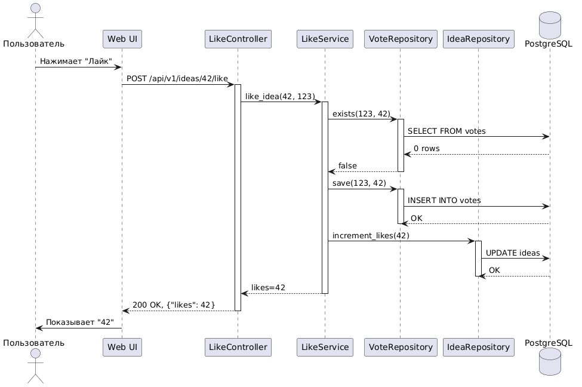

# Отчёт по лабораторной работе N1
## Транзакционные сценарии интернет-систем

**Студент**: Мартынюк Владимир
**Группа**: PO12-10
**Вариант**: 36 - Идеи "Лайк за мысль"
**Идентификатор**: PO12-10-MartyniukVladimir-36
**Дата**: 2026-03-12

## 1. Описание предметной области

Платформа для сбора идей "Лайк за мысль" позволяет пользователям публиковать идеи и голосовать за понравившиеся. Ключевые бизнес-правила:

- BR-001: Один пользователь может проголосовать за идею только один раз
- BR-002: Счетчик лайков должен быть консистентным (равняться количеству записей в votes)
- BR-003: Голосовать можно только за активные идеи

## 2. Выполненные задачи

### 2.1. Use-case описание (15/15 баллов)

Составлено полное описание use-case "Голосование за идею" (файл use-case.md):
- Первичный актор: Зарегистрированный пользователь
- Предусловия: авторизация, существование идеи, отсутствие предыдущего голоса
- Основной поток: 7 шагов
- Альтернативные потоки: повторное голосование
- Исключительные ситуации: ошибки БД, duplicate key, deadlock

### 2.2. Диаграммы последовательности (20+15=35/35 баллов)

Созданы 3 диаграммы в формате PlantUML (файлы в diagrams/):

#### Happy Path (успешное голосование)

*Диаграмма демонстрирует успешный сценарий: проверка голоса, вставка, обновление счетчика, коммит*

#### Error Case (повторное голосование)

*Обработка нарушения бизнес-правила BR-001*

#### Error Case (ошибка БД)

*Обработка недоступности базы данных с откатом транзакции*

### 2.3. Gherkin-сценарии (20/20 баллов)

Разработано 6 сценариев в формате Gherkin (файл scenarios.feature):
- Успешное голосование (happy path)
- Повторное голосование (409 Conflict)
- Несуществующая идея (404 Not Found)
- Неавторизованный доступ (401 Unauthorized)
- Ошибка базы данных (503 Service Unavailable)
- Конкурентное голосование (проверка корректности)

### 2.4. Анализ границ ответственности (15/15 баллов)

Проведен анализ (файл analysis.md):
- Таблица операций с типами и транзакционными границами
- Определение точек отказа
- Механизмы восстановления (retry, rollback, компенсация)
- Стратегии идемпотентности

### 2.5. Обработка исключений (10/10 баллов)

Описаны стратегии для 5 исключительных ситуаций:
1. Duplicate key violation
2. Deadlock
3. Недоступность БД
4. Конкурентное обновление
5. Сбой после INSERT

## 3. Реализация на Python (src/)

### 3.1. Доменная модель (src/domain/models.py)

```python
from dataclasses import dataclass
from datetime import datetime
from typing import Optional

@dataclass
class User:
    id: int
    email: str
    name: str

@dataclass
class Idea:
    id: int
    title: str
    description: str
    author_id: int
    likes_count: int = 0
    status: str = "ACTIVE"  # ACTIVE, DELETED
    
    def add_like(self):
        self.likes_count += 1
    
    def is_active(self) -> bool:
        return self.status == "ACTIVE"

@dataclass
class Vote:
    id: Optional[int]
    user_id: int
    idea_id: int
    created_at: datetime
