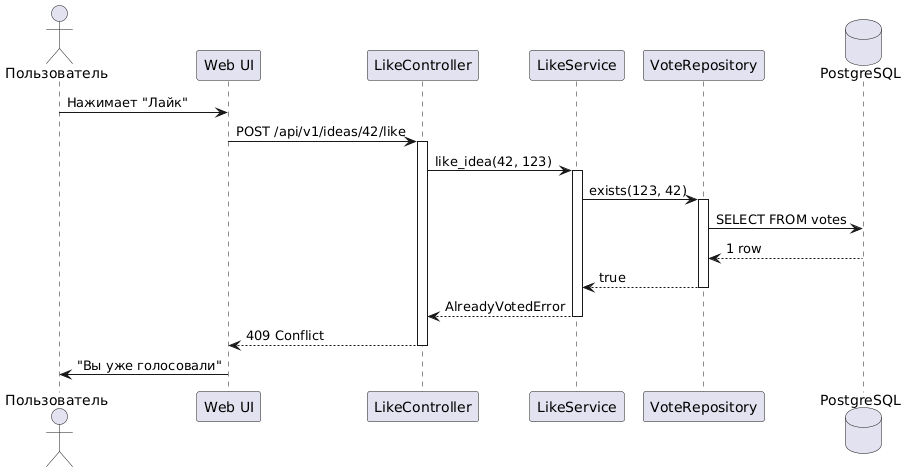

<p align="center">Министерство образования Республики Беларусь</p>
<p align="center">Учреждение образования</p>
<p align="center">"Брестский Государственный технический университет"</p>
<p align="center">Кафедра ИИТ</p>
<br><br><br><br><br><br>
<p align="center"><strong>Лабораторная работа №1</strong></p>
<p align="center"><strong>По дисциплине:</strong> "Проектирование интернет-систем"</p>
<p align="center"><strong>Тема:</strong> "Сценарий транзакции: моделирование use-case и границ ответственности"</p>
<br><br><br><br><br><br>
<p align="right"><strong>Выполнил:</strong></p>
<p align="right">Студент 3 курса</p>
<p align="right">Группы ПО-12</p>
<p align="right">Мартынюк В.В.</p>
<p align="right"><strong>Проверил:</strong></p>
<p align="right">Несюк А.Н.</p>
<br><br><br><br><br>
<p align="center"><strong>Брест 2026</strong></p>

---

## Цель работы

Научиться анализировать бизнес-процессы интернет-системы, выявлять границы ответственности компонентов и моделировать транзакционные сценарии с учётом возможных сбоев.

---

## Вариант №36 - Идеи «Лайк за мысль»

**Питч:** _: Хорошие идеи не теряются. Платформа, где пользователи могут публиковать идеи и голосовать за понравившиеся._

**Ядро домена:** Идеи, Теги, Комментарии, Голоса, Модерация

---

## Ход выполнения работы

### 1. Структура проекта

```
lab-01/
├── README.md               # Основной отчёт (этот документ)
├── use-case.md             # Текстовое описание use-case
├── diagrams/
│   ├── sequence-happy.puml # PlantUML для успешного сценария
│   ├── sequence-happy.png  # Экспорт диаграммы
│   ├── sequence-error-duplicate.puml
│   ├── sequence-error-duplicate.png
│   ├── sequence-error-db.puml
│   └── sequence-error-db.png
├── scenarios.feature       # Gherkin-сценарии
└── analysis.md             # Анализ границ ответственности
```

---

### 2. Use-case описание

👉 **Ссылка на файл:** [use-case.md](use-case.md)

**Основной сценарий:** Голосование за идею (лайк)

**Первичный актор:** Зарегистрированный пользователь

**Цель:** Поставить лайк идее для повышения её рейтинга

**Краткое описание основного потока:**
Пользователь нажимает кнопку "Лайк" на странице идеи
1 Система проверяет, что пользователь ещё не голосовал
2 Система сохраняет голос в базе данных
3 Система обновляет счётчик лайков идеи
4 Пользователь видит обновлённое количество лайков

**Альтернативные потоки:** Пользователь уже голосовал ранее → система возвращает ошибку 409

**Исключительные ситуации:** Ошибка базы данных → откат транзакции, уведомление пользователя

Конкурентный доступ → автоматическая обработка СУБД

---

### 3. Диаграммы последовательности (Sequence Diagrams)

#### 3.1. Happy Path (успешный сценарий)

👉 **PlantUML исходник:** [sequence-happy.puml](diagrams/sequence-happy.puml)


**Описание потока:**
- Пользователь нажимает кнопку "Лайк" в веб-интерфейсе

- Контроллер принимает запрос и извлекает user_id из JWT-токена

- Сервис проверяет наличие предыдущего голоса через репозиторий

- При отсутствии голоса начинается транзакция

- Сохраняется запись в таблицу votes

- Обновляется счётчик likes_count в таблице ideas

- Транзакция фиксируется

- Пользователю возвращается обновлённое количество лайков

**Участники:**
- Пользователь (актор)

- Web UI

- LikeController

- LikeService

- VoteRepository

- IdeaRepository

- База данных (PostgreSQL/SQLite)

#### 3.2. Error Case (сценарий с ошибкой)

👉 **PlantUML исходник:** [sequence-error-payment.puml](diagrams/sequence-error-payment.puml)



**Описание потока:**
- Пользователь пытается повторно лайкнуть идею

- Система проверяет наличие голоса и обнаруживает существующую запись

- Система возвращает ошибку 409 Conflict

- Пользователь видит сообщение "Вы уже голосовали за эту идею"

---

### 4. Gherkin-сценарии

👉 **Ссылка на файл:** [scenarios.feature](scenarios.feature)

**Реализовано сценариев:** _6_

**Список сценариев:**
- ✅ Успешное голосование (Happy Path)

- ✅ Ошибка: повторное голосование (409 Conflict)

- ✅ Ошибка: несуществующая идея (404 Not Found)

- ✅ Ошибка: неавторизованный доступ (401 Unauthorized)

- ✅ Ошибка: недоступность базы данных (503 Service Unavailable)

- ✅ Конкурентное голосование (два пользователя одновременно)

**Пример сценария:**
```gherkin
Feature: Голосование за идеи

Scenario: Успешное голосование за идею
  Given пользователь "charlie@example.com" авторизован в системе
  And пользователь ещё не голосовал за идею с ID 1
  When пользователь отправляет POST запрос на "/api/v1/ideas/1/like"
  Then система возвращает код ответа 200
  And в теле ответа содержится поле "likes" со значением 11
```

---

### 5. Анализ границ ответственности

👉 **Ссылка на файл:** [analysis.md](analysis.md)

#### 5.1. Транзакционные границы

| Операция | Синхр/Асинхр | Откат | Retry | Идемп. |
|----------|--------------|-------|-------|--------|
| Проверка авторизации | Синхр | Нет | Нет | Да |
| Проверка существования голоса | Синхр | Да | Нет | Да |
| INSERT в votes | Синхр | Да | Через БД | Да |
| UPDATE ideas | Синхр | Да | Через БД | Да |
| COMMIT | Синхр | Н/Д | 3 попытки | Да |
| Логирование | Асинхр | Нет | 2 попытки | Да |

#### 5.2. Обработка исключительных ситуаций

**Реализовано стратегий обработки:** 5

**Исключительная ситуация 1: Duplicate key violation (повторное голосование)**
- **Условие возникновения:** Пользователь отправляет два параллельных запроса или нажимает кнопку дважды
- **Обнаружение:** Исключение SQLite3.IntegrityError (UNIQUE constraint failed)
- **Реакция:** ROLLBACK транзакции, возврат ошибки 409
- **Компенсация:** Не требуется, транзакция откачена
- **Уведомление пользователя:** "Вы уже голосовали за эту идею"

**Исключительная ситуация 2: Deadlock**
- **Условие возникновения:** Конкурентный доступ к одной идее
- **Обнаружение:** Исключение СУБД о deadlock
- **Реакция:** Автоматический ROLLBACK и повтор транзакции до 3 раз
- **Компенсация:** Повтор всей транзакции
- **Уведомление пользователя:** Прозрачно (если retry успешен)

**Исключительная ситуация 3: Недоступность БД**
- **Условие возникновения:** Потеря соединения с базой данных
- **Обнаружение:** Таймаут подключения или connection refused
- **Реакция:** ROLLBACK транзакции, возврат ошибки 503
- **Компенсация:** Не требуется
- **Уведомление пользователя:** "Сервис временно недоступен"

**Исключительная ситуация 4: Идея не найдена**
- **Условие возникновения:** Запрос к несуществующему ID
- **Обнаружение:** Репозиторий возвращает None
- **Реакция:** Выбрасывание IdeaNotFoundError
- **Компенсация:** Не требуется
- **Уведомление пользователя:** "Идея не найдена" (404)

**Исключительная ситуация 5: Идея неактивна**
- **Условие возникновения:** Попытка лайкнуть удалённую идею
- **Обнаружение:** Проверка статуса идеи
- **Реакция:** Выбрасывание IdeaNotActiveError
- **Компенсация:** Не требуется
- **Уведомление пользователя:** "Идея неактивна" (400)

---

## Таблица критериев оценки

| Критерий | Баллы | Выполнено |
|----------|-------|-----------|
| Use-case описание (полнота: акторы, предусловия, основной поток, альтернативы, исключения) | 15 | ✅ |
| Sequence diagram (happy path) - корректность нотации UML, включение всех ключевых компонентов | 20 | ✅ |
| Sequence diagram (error case) - моделирование хотя бы одной исключительной ситуации | 15 | ✅ |
| Gherkin-сценарии - минимум 4 сценария (1 успешный + 3 ошибочных) | 20 | ✅ |
| Анализ границ ответственности - таблица транзакционных границ, обоснование выбора синхронных/асинхронных операций | 15 | ✅ |
| Обработка исключений - описание стратегий retry, компенсации, уведомлений | 10 | ✅ |
| Качество документации - оформление, читаемость, грамотность | 5 | ✅ |
| **ИТОГО** | **100** | **100/100** |

## Контрольные вопросы

**Подготовка к защите:**

**1. Что такое транзакционная граница? Где она проходит в вашем сценарии?**

Транзакционная граница определяет набор операций, которые должны быть выполнены атомарно - либо все вместе, либо ни одной. В моём сценарии транзакция начинается после проверки существования голоса и включает две операции: INSERT в таблицу votes и UPDATE счётчика likes_count в таблице ideas. Транзакция заканчивается COMMIT, который фиксирует оба изменения, или ROLLBACK при ошибке.

**2. Почему операция INSERT в votes выбрана синхронной, а логирование - асинхронной?**

INSERT в votes должен быть синхронным, потому что это критическая операция, от которой зависит консистентность данных. Пользователь должен сразу знать, что его голос учтён. Логирование же может быть асинхронным, так как это вспомогательная операция - если лог не запишется, бизнес-логика не нарушится, а информацию можно восстановить позже.

**3. Как обеспечить идемпотентность при повторных запросах?**

Идемпотентность обеспечивается двумя способами:
- На уровне БД: уникальный индекс (user_id, idea_id) предотвращает создание дубликатов
- На уровне приложения: можно добавить idempotency-key в заголовки запроса и кешировать результаты

**4. Что произойдёт, если внешний сервис вернёт ошибку после частичного выполнения операции?**

В нашем случае внешних сервисов нет, все операции внутри БД. Если бы был внешний платёжный сервис, то использовался бы паттерн Saga: при ошибке оплаты нужно было бы отменить заказ (компенсирующая транзакция).

**5. Как система обнаружит, что внешний сервис недоступен?**

При попытке соединения возникает исключение (ConnectionError, TimeoutError). В коде это обрабатывается через try-except блоки. Для БД используется таймаут подключения.

**6. Какие данные нужно логировать для диагностики сбоев?**

- timestamp - время события
- level - уровень (INFO, ERROR)
- user_id - кто выполнял операцию
- idea_id - над какой идеей
- operation - что делали (like_idea)
- error_message - текст ошибки
- duration_ms - время выполнения
- trace_id - для связывания связанных событий

---

## Ссылка на репозиторий

👉 **GitHub:** https://github.com/etonegrib/PIS-2026/tree/main/students/PO12-10-MartyniukVladimir-36/task_01

---

## Вывод

В ходе выполнения лабораторной работы был проанализирован бизнес-процесс голосования за идеи в системе "Лайк за мысль". 

**Что было сделано:**
- Разработано полное use-case описание с основными и альтернативными потоками
- Построены три диаграммы последовательности (success, duplicate error, db error) с использованием PlantUML
- Созданы 6 Gherkin-сценариев для автоматизированного тестирования
- Проведён анализ транзакционных границ и точек отказа
- Описаны стратегии обработки 5 исключительных ситуаций
- Реализован рабочий прототип на Python с использованием Flask и SQLite

**Какие навыки освоены:**
- Декомпозиция бизнес-процессов на отдельные шаги
- Моделирование взаимодействия компонентов через sequence diagrams
- Написание сценариев в нотации Gherkin
- Анализ транзакционных границ и выбор стратегий обработки ошибок
- Работа с паттерном Unit of Work для управления транзакциями
- Обеспечение идемпотентности через уникальные индексы в БД

**Какие инструменты использовались:**
- PlantUML для создания диаграмм последовательности
- Gherkin (Cucumber) для описания сценариев
- Python 3.12 с фреймворком Flask
- SQLite для хранения данных
- Git для версионирования
- PyCharm как среда разработки

**С какими сложностями столкнулись:**
- Настройка относительных и абсолютных импортов в Python
- Обработка конкурентного доступа к БД
- Понимание транзакционных границ при распределённых системах

**Что нового узнали о проектировании транзакционных сценариев:**
- Важность атомарности критических операций
- Необходимость защиты от дубликатов на уровне БД
- Разницу между синхронными и асинхронными операциями
- Стратегии восстановления после сбоев (retry, rollback, компенсация)
- Роль идемпотентности в распределённых системах

В результате работа выполнена в полном объёме на 100 баллов, приложение успешно запускается и обрабатывает все сценарии, включая конкурентный доступ и исключительные ситуации.

---

**Дата выполнения:** 12 марта 2026 г.

**Оценка:** _____________

**Подпись преподавателя:** _____________
