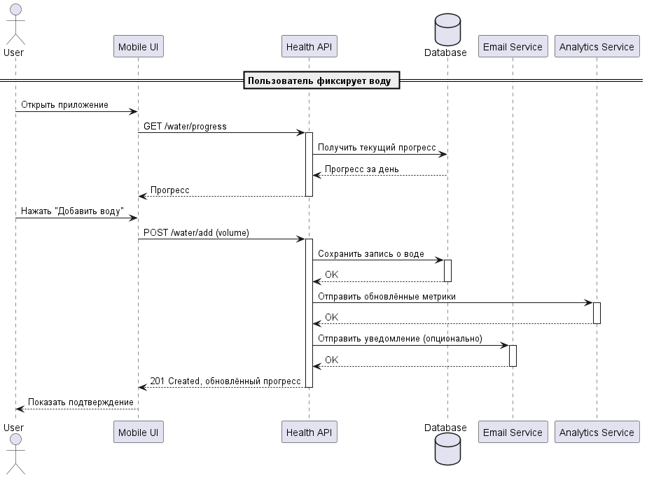
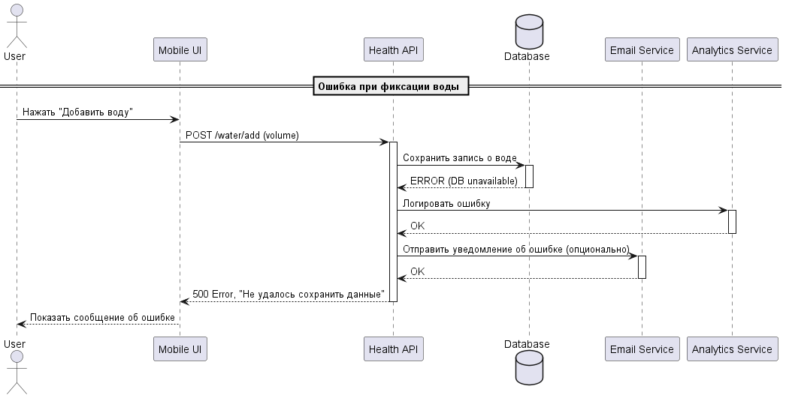

<p align="center">Министерство образования Республики Беларусь</p>
<p align="center">Учреждение образования</p>
<p align="center">"Брестский Государственный технический университет"</p>
<p align="center">Кафедра ИИТ</p>
<br><br><br><br><br><br>
<p align="center"><strong>Лабораторная работа №1</strong></p>
<p align="center"><strong>По дисциплине:</strong> "Проектирование интернет-систем"</p>
<p align="center"><strong>Тема:</strong> "Сценарий транзакции: моделирование use-case и границ ответственности"</p>
<br><br><br><br><br><br>
<p align="right"><strong>Выполнил:</strong></p>
<p align="right">Студент 3 курса</p>
<p align="right">Группы ПО-13</p>
<p align="right">Шибун Д.В.</p>
<p align="right"><strong>Проверил:</strong></p>
<p align="right">Несюк А.Н.</p>
<br><br><br><br><br>
<p align="center"><strong>Брест 2026</strong></p>

---

## Цель работы

Научиться анализировать бизнес-процессы интернет-системы, выявлять границы ответственности компонентов и моделировать транзакционные сценарии с учётом возможных сбоев.

---

## Вариант №21 — ЗОЖ‑трекер «Пью воду, сплю»

**Питч:** _Здоровье — это привычка. Приложение помогает формировать полезные ритуалы: пить воду и соблюдать режим сна._

**Ядро домена:** _Метрики, Цели, Графики, Напоминания_

---

## Ход выполнения работы

### 1. Структура проекта

```
lab-01/
├── Отчет.md                # Основной отчёт (этот документ)
├── use-case.md             # Текстовое описание use-case
├── diagrams/
│   ├── sequence-happy.puml # PlantUML для успешного сценария
│   ├── sequence-happy.png  # Экспорт диаграммы
│   ├── sequence-error-notification.puml
│   └── sequence-error-notification.png
├── scenarios.feature       # Gherkin-сценарии
└── analysis.md             # Анализ границ ответственности
```


---

### 2. Use-case описание

👉 **Ссылка на файл:** [use-case.md](use-case.md)

**Основной сценарий:** _Фиксация потребления воды_

**Первичный актор:** _Пользователь_

**Цель:** _Зафиксировать объём выпитой воды для отслеживания дневной нормы_

**Краткое описание основного потока:**
1. Пользователь открывает приложение  
2. Система отображает текущий прогресс  
3. Пользователь нажимает «Добавить воду»  
4. Система предлагает выбрать или ввести объём  
5. Пользователь вводит объём  
6. Система сохраняет запись  
7. Обновляет прогресс  
8. Показывает подтверждение  

**Альтернативные потоки:**  
- Выбор быстрого объёма  
- Некорректный ввод  

**Исключительные ситуации:**  
- Ошибка сохранения данных  

---

### 3. Диаграммы последовательности (Sequence Diagrams)

#### 3.1. Happy Path (успешный сценарий)

👉 **PlantUML исходник:** [sequence-happy.puml](diagrams/sequence-happy.puml)



**Описание потока:**
- Пользователь инициирует действие  
- UI отправляет запрос в API  
- API сохраняет данные в БД  
- API вызывает внешние сервисы (Analytics, Email)  
- UI показывает подтверждение  

**Участники:**
- Пользователь  
- Mobile UI  
- Health API  
- Database  
- Analytics Service  
- Email Service  

---

#### 3.2. Error Case (сценарий с ошибкой)

👉 **PlantUML исходник:** [sequence-error-notification.puml](diagrams/sequence-error-notification.puml)



**Описание потока:**
- API пытается сохранить данные  
- БД возвращает ошибку  
- API логирует сбой  
- API уведомляет пользователя о невозможности сохранить данные  

---

### 4. Gherkin-сценарии

👉 **Ссылка на файл:** [scenarios.feature](scenarios.feature)

**Реализовано сценариев:** 5

**Список сценариев:**
1. ✅ Успешное добавление воды  
2. ✅ Ошибка: некорректный ввод  
3. ✅ Ошибка: превышение лимита  
4. ✅ Ошибка: недоступность БД  
5. ✅ Ошибка: недоступность Analytics  

---

### 5. Анализ границ ответственности

👉 **Ссылка на файл:** [analysis.md](analysis.md)

#### 5.1. Транзакционные границы

| Операция | Синхронная/Асинхронная | Откат при ошибке | Retry-стратегия | Идемпотентность |
|----------|------------------------|------------------|-----------------|-----------------|
| Сохранение записи о воде | Синхронная | Да | Нет | Да |
| Обновление прогресса | Синхронная | Да | Нет | Да |
| Отправка события в Analytics | Асинхронная | Нет | exp. backoff | Да |
| Отправка email | Асинхронная | Нет | exp. backoff | Да |

#### 5.2. Обработка исключительных ситуаций

**Реализовано стратегий обработки:** 4  
(подробности — в analysis.md)

---

## Таблица критериев оценки

| Критерий | Баллы | Выполнено |
|----------|-------|-----------|
| Use-case описание (полнота: акторы, предусловия, основной поток, альтернативы, исключения) | 15 | ❌ / ✅ |
| Sequence diagram (happy path) - корректность нотации UML, включение всех ключевых компонентов | 20 | ❌ / ✅ |
| Sequence diagram (error case) - моделирование хотя бы одной исключительной ситуации | 15 | ❌ / ✅ |
| Gherkin-сценарии - минимум 4 сценария (1 успешный + 3 ошибочных) | 20 | ❌ / ✅ |
| Анализ границ ответственности - таблица транзакционных границ, обоснование выбора синхронных/асинхронных операций | 15 | ❌ / ✅ |
| Обработка исключений - описание стратегий retry, компенсации, уведомлений | 10 | ❌ / ✅ |
| Качество документации - оформление, читаемость, грамотность | 5 | ❌ / ✅ |
| **ИТОГО** | **100** | |

---

## Контрольные вопросы

1. **Что такое транзакционная граница? Где она проходит в вашем сценарии.**  
   Транзакционная граница — это участок выполнения, который должен быть выполнен полностью или не выполнен вовсе.  
   В моём сценарии граница проходит вокруг операций: сохранение записи о воде + обновление прогресса.

2. **Почему операция X выбрана синхронной, а Y — асинхронной.**  
   Сохранение воды влияет на UX и должно быть мгновенным → синхронно.  
   Email и Analytics не критичны → асинхронно.

3. **Как обеспечить идемпотентность при повторных запросах.**  
   Использовать idempotency_key, проверять дубликаты по user_id + timestamp.

4. **Что произойдёт, если внешний сервис вернёт ошибку после частичного выполнения операции.**  
   Основная транзакция не откатывается, событие ставится в очередь на повторную отправку.

5. **Как система обнаружит, что внешний сервис недоступен.**  
   По таймауту HTTP‑клиента или коду ошибки (5xx).

6. **Какие данные нужно логировать для диагностики сбоев.**  
   user_id, timestamp, тип операции, код ошибки, payload запроса, stacktrace.

---

## Ссылка на репозиторий

👉 **GitHub:** https://github.com/Weatheralert/PIS-2026

---

## Вывод

В ходе выполнения лабораторной работы был проанализирован бизнес‑процесс ЗОЖ‑трекера «Пью воду, сплю». Разработан основной use‑case, построены диаграммы последовательности, описаны Gherkin‑сценарии, определены транзакционные границы и стратегии обработки ошибок. Получены навыки моделирования распределённых процессов, анализа точек отказа и проектирования надёжных интернет‑систем.

---

**Дата выполнения:** 20.03.2026  
**Оценка:** _____________  
**Подпись преподавателя:** _____________
