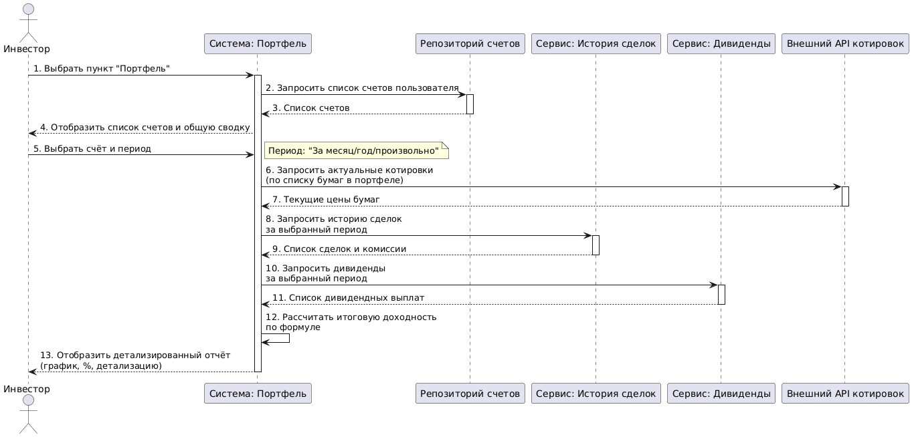
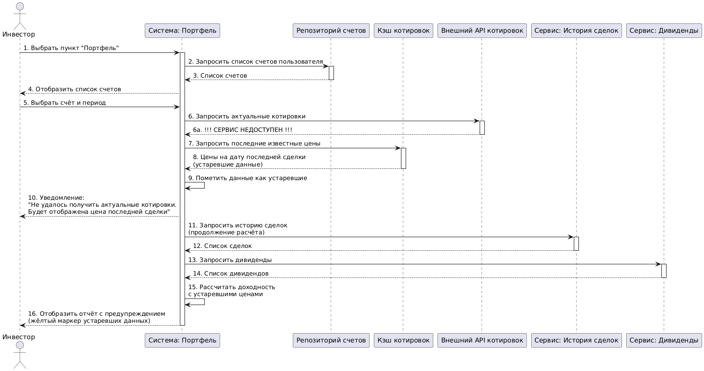

<p align="center">Министерство образования Республики Беларусь</p>
<p align="center">Учреждение образования</p>
<p align="center">"Брестский Государственный технический университет"</p>
<p align="center">Кафедра ИИТ</p>
<br><br><br><br><br><br>
<p align="center"><strong>Лабораторная работа №1</strong></p>
<p align="center"><strong>По дисциплине:</strong> "Проектирование интернет-систем"</p>
<p align="center"><strong>Тема:</strong> "Сценарий транзакции: моделирование use-case и границ ответственности"</p>
<br><br><br><br><br><br>
<p align="right"><strong>Выполнил:</strong></p>
<p align="right">Студент 3 курса</p>
<p align="right">Группы ПО-13</p>
<p align="right">Тарасюк М.И.</p>
<p align="right"><strong>Проверил:</strong></p>
<p align="right">Шорох Д.В.</p>
<br><br><br><br><br>
<p align="center"><strong>Брест 2026</strong></p>

---

## Цель работы

Научиться анализировать бизнес-процессы интернет-системы, выявлять границы ответственности компонентов и моделировать транзакционные сценарии с учётом возможных сбоев.

---

## Вариант №48 - Портфель инвестиций «Деньги растут» 📈

**Питч:** Отслеживай акции и спи спокойно.

**Ядро домена:** Брокерские счёта, Ценные бумаги, Портфель, История сделок, Дивиденды

---

## Ход выполнения работы

### 1. Структура проекта

```
lab-01/
├── Отчет.md               # Основной отчёт (этот документ)
├── use-case.md             # Текстовое описание use-case
├── diagrams/
│   ├── sequence-happy.puml # PlantUML для успешного сценария
│   ├── sequence-happy.png  # Экспорт диаграммы
│   ├── sequence-error-payment.puml
│   └── sequence-error-payment.png
├── scenarios.feature       # Gherkin-сценарии
└── analysis.md             # Анализ границ ответственности
```

---

### 2. Use-case описание

👉 **Ссылка на файл:** [use-case.md](use-case.md)

**Основной сценарий:** Просмотр доходности портфеля

**Первичный актор:** Инвестор

**Цель:** Получить информацию о росте стоимости портфеля с учетом диведендов и транзакционных издержек 

**Краткое описание основного потока:**
1. Инвестор выбирает в меню пункт "Портфель"
2. Система отображает список доступных брокерских счетов инвестора и общую сводку.
3. Инвестор выбирает интиресующий счет и период времени
4. Система запрашивает и получает из внешнего источника актуальные цены для всех ценных бумаг, находящихся в портфеле.
5. Система анализирует историю сделок за выбранный период и рассчитывает финансовый результат по каждой закрытой позиции, суммирует все комиссии брокера и биржи за совершённые сделки в периоде.
6. Система анализирует историю дивидендных выплат за выбранный период и суммирует их.
7. Система рассчитывает итоговую доходность портфеля за период по формуле: (Текущая стоимость бумаг - Стоимость бумаг на начало периода + Сумма дивидендов + Сальдо закрытых сделок) / (Стоимость бумаг на начало периода + Сумма пополнений за период).
8. Система отображает инвестору детализированный отчёт (график изменения стоимости портфеля, итоговый процент доходности, детализацию: сколько принесли дивиденды, сколько — рост курсовой стоимости, сколько ушло на комиссии).

**Альтернативные потоки:** 
Инввестор не указал период
Ценные бумаги в разных валютах

**Исключительные ситуации:** 
Сервис рыночных данных временно недоступен или не отвечает
Ошибка при расчёте налогов с дивидендов

---

### 3. Диаграммы последовательности (Sequence Diagrams)

#### 3.1. Happy Path (успешный сценарий)

👉 **PlantUML исходник:** [sequence-happy.puml](diagrams/sequence-happy.puml)



**Описание потока:**
- Инвестор запрашивает доходность портфеля, система последовательно собирает данные из различных источников: список счетов из репозитория, историю сделок и дивидендов, актуальные котировки от внешнего сервиса. После обработки всех данных система рассчитывает итоговую доходность по формуле и отображает инвестору детализированный отчёт.

**Участники:**
- Инвестор — пользователь системы (актор)
- Портфель — компонент, управляющий отображением и логикой портфеля
- Репозиторий счетов — хранилище данных о брокерских счетах
- История сделок — компонент, хранящий и анализирующий транзакции
- Дивиденды — компонент, хранящий историю дивидендных выплат
- Внешний API котировок — внешний сервис для получения рыночных данных

#### 3.2. Error Case (сценарий с ошибкой)

👉 **PlantUML исходник:** [sequence-error-payment.puml](diagrams/sequence-error-payment.puml)



**Описание потока:**
- При попытке получить актуальные котировки внешний сервис недоступен. Система переходит в режим пониженной функциональности: уведомляет пользователя о проблеме, продолжает расчёт с использованием последних известных цен и помечает устаревшие данные в итоговом отчёте специальным маркером.

---

### 4. Gherkin-сценарии

👉 **Ссылка на файл:** [scenarios.feature](scenarios.feature)

**Реализовано сценариев:** 5

**Список сценариев:**
1. ✅ **Успешный сценарий** (Happy Path)
2. ✅ **Ошибка:** Сервис котировок временно недоступен
3. ✅ **Ошибка:** В портфеле присутствуют бумаги в разных валютах
4. ✅ **Ошибка:** Пользователь не указал период расчёта
5. ✅ **Ошибка:** Ошибка при расчёте налогов с дивидендов

**Пример сценария:**
```gherkin
Feature: Просмотр доходности портфеля

Scenario: Успешный расчёт доходности портфеля за выбранный период
  Given пользователь находится на странице "Портфель"
  пользователь выбирает счёт "Основной"
    And пользователь указывает период "Последний месяц"
    And система успешно получает актуальные котировки:
      | AAPL | 170 |
      | MSFT | 320 |
    Then система рассчитывает доходность за период
    And система отображает детализированный отчёт
    And в отчёте указан итоговый процент доходности
    And в отчёте отображена детализация:
      | Показатель        | Сумма |
      | Курсовой рост     | 250   |
      | Дивиденды         | 45    |
      | Комиссии          | 12    |
      | Итоговая доходность | 5.7%  |
```

---

## 5. Анализ границ ответственности

👉 **Ссылка на файл:** [analysis.md](analysis.md)

#### 5.1. Транзакционные границы

| Операция | Синхронная/Асинхронная | Откат при ошибке | Retry-стратегия | Идемпотентность |
|----------|------------------------|------------------|-----------------|-----------------|
| **Получение котировок** | Синхронная | Нет | Exponential backoff (3 попытки) с таймаутом 2 сек | Да (GET-запрос) |
| **Расчёт доходности портфеля** | Синхронная | Частичный (кэширование промежуточных результатов) | Нет | Да (для одинаковых параметров запроса) |
| **Конвертация валют** | Синхронная | Нет | 1 повтор при ошибке курса | Да |
| **Обновление кэша котировок** | Асинхронная (фоновый job) | Да (откат кэша) | Fixed delay (каждые 15 мин) | Да (по timestamp) |

#### 5.2. Обработка исключительных ситуаций

**Реализовано стратегий обработки:** 4

##### Исключительная ситуация 1: Недоступность внешнего API котировок

- **Условие возникновения:** Внешний сервис рыночных данных не отвечает в течение 3 секунд или возвращает HTTP 5xx
- **Обнаружение:** Таймаут при вызове API, перехват исключения NetworkException / TimeoutException
- **Реакция:** Система переключается на использование кэшированных данных (последние известные цены). Запускает фоновый процесс повторных попыток с экспоненциальной задержкой (2с, 5с, 15с). При успешном восстановлении — обновляет кэш асинхронно.
- **Компенсация:** Не требуется, так как данные только читаются, операции записи не производятся. Пометка данных как "устаревшие" в кэше.
- **Уведомление пользователя:** Баннер с текстом: "Не удалось получить актуальные котировки для некоторых бумаг. Будет отображена цена последней сделки или цена закрытия предыдущего дня". В отчёте данные помечаются жёлтым маркером.

##### Исключительная ситуация 2: Некорректные данные по дивидендам (ошибка в налогах)

- **Условие возникновения:** При расчёте дивидендной части сервис дивидендов возвращает данные с невалидной суммой налога (отрицательное значение, превышение суммы дивиденда) или отсутствием обязательных полей
- **Обнаружение:** Валидация DTO на уровне сервиса дивидендов, выбрасывание InvalidDividendDataException
- **Реакция:** Система откатывает расчёт дивидендной части до момента получения данных. Изолирует проблемную позицию (бумагу) от общего расчёта. Сохраняет корректные данные по остальным бумагам.
- **Компенсация:** Частичный откат — дивиденды по проблемной бумаге исключаются из расчёта, остальные продолжают участвовать.
- **Уведомление пользователя:** Модальное окно: "Не удалось рассчитать чистую сумму дивидендов по одной из бумаг (ошибка в данных брокера)". Кнопки выбора: "Просмотреть отчёт без учёта налога" / "Повторить попытку позже".

##### Исключительная ситуация 3: Конфликт валют при расчёте

- **Условие возникновения:** В портфеле присутствуют бумаги в разных валютах, но курс конвертации для одной из валют отсутствует (не загружен или устарел более чем на 24 часа)
- **Обнаружение:** Проверка актуальности курсов перед конвертацией, обнаружение отсутствующей записи в кэше курсов
- **Реакция:** Система пытается получить актуальный курс из внешнего API (1 попытка). При неудаче — приостанавливает расчёт и запрашивает подтверждение у пользователя на использование последнего известного курса.
- **Компенсация:** Не требуется до подтверждения пользователя.
- **Уведомление пользователя:** Диалог: "Отсутствует актуальный курс для валюты XXX. Доступен курс от ДД.ММ.ГГГГ. Продолжить расчёт с устаревшим курсом?" (Да/Нет)

##### Исключительная ситуация 4: Частичная потеря данных при расчёте

- **Условие возникновения:** При агрегации данных из разных источников (сделки, дивиденды, котировки) один из источников вернул пустой результат или неполные данные
- **Обнаружение:** Проверка целостности данных перед расчётом, подсчёт ожидаемого количества записей
- **Реакция:** Система логирует инцидент, продолжает расчёт с доступными данными, помечает отчёт как "неполный"
- **Компенсация:** Нет, данные не модифицируются
- **Уведомление пользователя:** Информационное сообщение вверху отчёта: "Некоторые данные за выбранный период отсутствуют. Результат может быть неполным. Рекомендуется проверить соединение и повторить попытку."
---

## Таблица критериев оценки

| Критерий | Баллы | Выполнено |
|----------|-------|-----------|
| Use-case описание (полнота: акторы, предусловия, основной поток, альтернативы, исключения) | 15 | ✅ |
| Sequence diagram (happy path) - корректность нотации UML, включение всех ключевых компонентов | 20 | ✅ |
| Sequence diagram (error case) - моделирование хотя бы одной исключительной ситуации | 15 | ✅ |
| Gherkin-сценарии - минимум 4 сценария (1 успешный + 3 ошибочных) | 20 | ✅ |
| Анализ границ ответственности - таблица транзакционных границ, обоснование выбора синхронных/асинхронных операций | 15 | ✅ |
| Обработка исключений - описание стратегий retry, компенсации, уведомлений | 10 | ✅ |
| Качество документации - оформление, читаемость, грамотность | 5 | ✅ |
| **ИТОГО** | **100** | |

---

## Контрольные вопросы

**Подготовка к защите:**

1. Что такое транзакционная граница? Где она проходит в вашем сценарии?
   - Транзакционная граница — это место, где заканчивается гарантия целостности данных. Внутри границы всё выполняется атомарно (всё или ничего). За границей — зона риска, где нужны компенсационные действия.
   В моём сценарии граница проходит между системой и внешним API котировок. Когда мы запрашиваем цены из внешнего сервиса, мы не можем контролировать его состояние и не можем откатить его изменения — это распределённая транзакция без двухфазного коммита.

2. Почему операция X выбрана синхронной, а Y - асинхронной?
   - Получение котировок (синхронно): Пользователь ждёт результат здесь и сейчас. Ему нужны актуальные цены для расчёта доходности.
   Синхронный запрос даёт мгновенную обратную связь. Обновление кэша котировок (асинхронно): Это фоновая задача, не привязанная к действиям пользователя. Кэш можно обновлять раз в 15 минут без влияния на пользовательский опыт. Если обновление упадёт — ничего страшного, следующий цикл починит.

3. Как обеспечить идемпотентность при повторных запросах?
   - Идемпотентность — повторный запрос даёт тот же результат, что и первый.
   Способы в моём сценарии:
    GET-запросы к API котировок — идемпотентны по природе (сколько ни спрашивай цену AAPL, получишь одно и то же на момент запроса)
    Для расчёта доходности — добавить параметр requestId (уникальный ID запроса). Если приходит повторный запрос с тем же ID, отдаём закэшированный результат расчёта, не пересчитываем заново
    Timestamp — проверять дату последнего обновления, не обновлять кэш, если данные свежее

4. Что произойдёт, если внешний сервис вернёт ошибку после частичного выполнения операции?
   - Кейс: Мы получили цены по AAPL, но MSFT упал с ошибкой.
    Реакция системы:
      Не используем частичные данные — это введёт в заблуждение
      Откатываемся к кэшу по обоим бумагам (берём последние известные цены)
      Помечаем отчёт как "устаревшие данные"
      Логируем инцидент: "Получены неполные котировки, использован кэш от ДД.ММ.ГГГГ"
      Запускаем фоновый job для повторной попытки обновления кэша

5. Как система обнаружит, что внешний сервис недоступен?
   - Механизмы обнаружения:
  Таймаут — если ответ не пришёл за N секунд (в сценарии — 3 сек), прерываем соединение
  HTTP коды ошибок — 500, 502, 503, 504
  Health check endpoint — отдельный лёгкий запрос для проверки здоровья сервиса (ping/pong)
  Circuit Breaker — после 3 ошибок подряд перестаём стучаться в сервис N минут, сразу отдаём кэш

6. Какие данные нужно логировать для диагностики сбоев?
   - Обязательный набор:
      Timestamp — точное время ошибки
      ID пользователя — кто пострадал
      Тикеры бумаг — по каким инструментам не пришли данные
      Тип ошибки — таймаут / 500 / некорректные данные
      Время отклика — сколько ждали до таймаута
      Данные кэша — какие цены использовали вместо актуальных (дата последнего обновления)
      Request ID — для связки с конкретным запросом пользователя
      Stack trace — если было исключение
    Дополнительно:
      Метрики в мониторинг (графана) — процент успешных запросов к API, среднее время ответа
---

## Ссылка на репозиторий

👉 **GitHub:** [репозиторий](https://github.com/DobryiZlodey/PIS-2026)

---

## Вывод

> В ходе выполнения лабораторной работы был проанализирован бизнес-процесс "Просмотр доходности инвестиционного портфеля" для системы «Деньги растут». Разработаны use-case диаграммы для основного сценария и альтернативных потоков, описывающие ключевую функциональность ядра домена. Построены sequence diagrams с использованием PlantUML для визуализации взаимодействия компонентов системы как в успешном сценарии, так и при возникновении ошибок. Созданы Gherkin-сценарии для автоматизированного тестирования пяти ключевых сценариев использования, включая граничные случаи и обработку исключений. Определены транзакционные границы и стратегии обработки ошибок при работе с внешними сервисами, реализованы четыре стратегии обработки исключительных ситуаций с компенсационными действиями и уведомлением пользователя. Освоены навыки моделирования распределённых транзакций и анализа точек отказа в интернет-системах на примере финансового приложения, работающего с внешними источниками рыночных данных и требующего высокой надёжности расчётов.
---

**Дата выполнения:** 01.03.2026

**Оценка:** _____________

**Подпись преподавателя:** _____________
