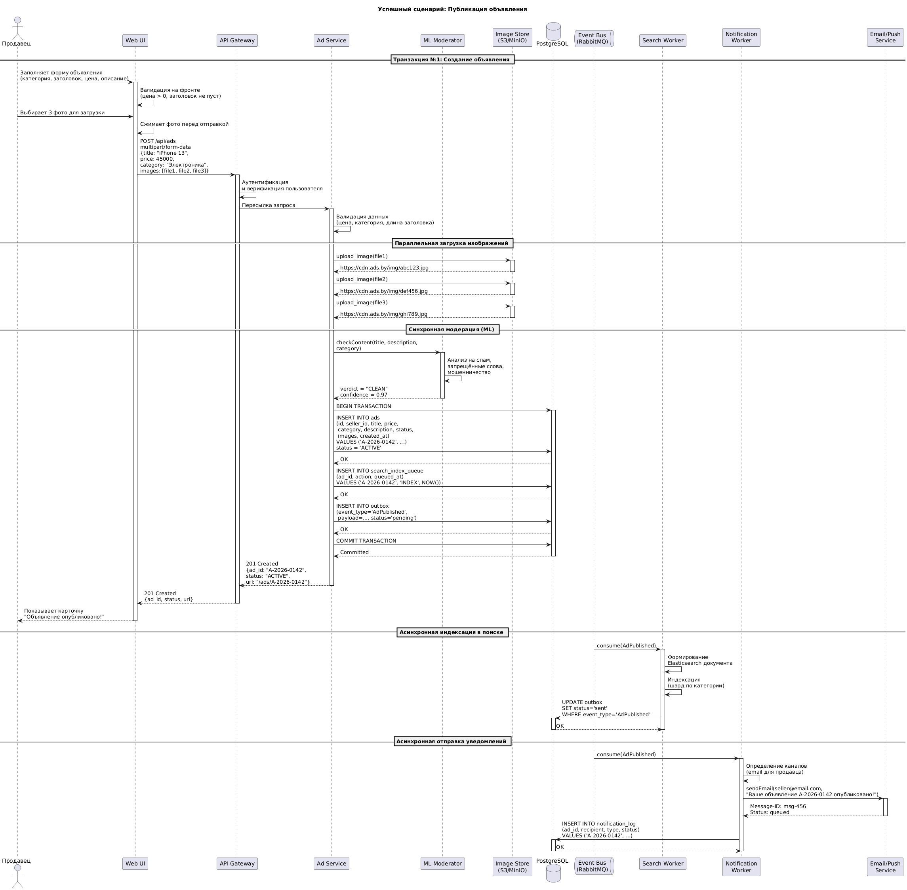
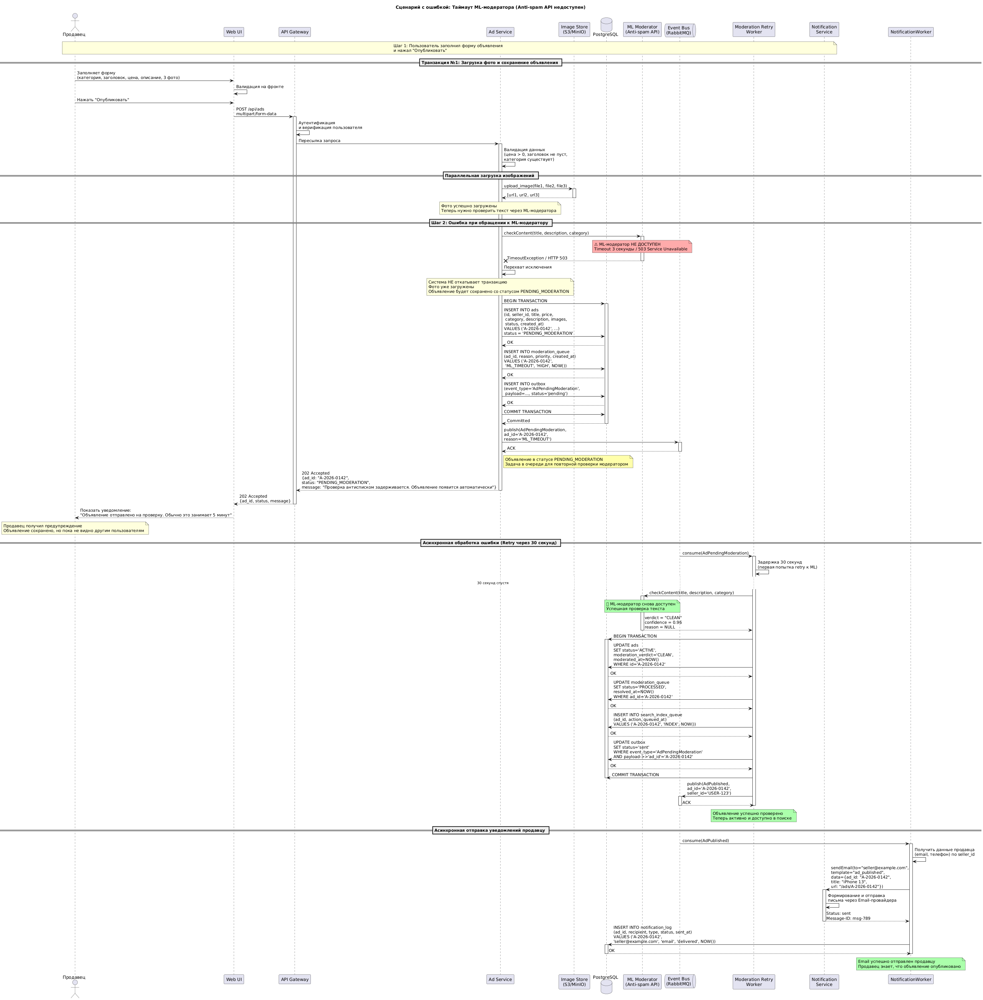

<p align="center">Министерство образования Республики Беларусь</p>
<p align="center">Учреждение образования</p>
<p align="center">"Брестский Государственный технический университет"</p>
<p align="center">Кафедра ИИТ</p>
<br><br><br><br><br><br>
<p align="center"><strong>Лабораторная работа №1</strong></p>
<p align="center"><strong>По дисциплине:</strong> "Проектирование интернет-систем"</p>
<p align="center"><strong>Тема:</strong> "Сценарий транзакции: моделирование use-case и границ ответственности"</p>
<br><br><br><br><br><br>
<p align="right"><strong>Выполнил:</strong></p>
<p align="right">Студент 3 курса</p>
<p align="right">Группы ПО-13</p>
<p align="right">Тютьков К.О.</p>
<p align="right"><strong>Проверил:</strong></p>
<p align="right">Несюк А.Н.</p>
<br><br><br><br><br>
<p align="center"><strong>Брест 2026</strong></p>

---

## Цель работы

Научиться анализировать бизнес-процессы интернет-системы, выявлять границы ответственности компонентов и моделировать транзакционные сценарии с учётом возможных сбоев.

---

## Вариант №8 - Доска объявлений «Бери, пока горячее»

**Питч:** _От велосипеда до учебника - всё тут._

**Ядро домена:** _Объявления, Категории, Чаты, Модерация_


---

## Ход выполнения работы

### 1. Структура проекта

```
lab-01/
├── README.md               # Основной отчёт (этот документ)
├── use-case.md             # Текстовое описание use-case
├── diagrams/
│   ├── sequence-happy.puml # PlantUML для успешного сценария
│   ├── sequence-happy.png  # Экспорт диаграммы
│   ├── sequence-error-payment.puml
│   └── sequence-error-payment.png
├── scenarios.feature       # Gherkin-сценарии
└── analysis.md             # Анализ границ ответственности
```

---

### 2. Use-case описание

👉 **Ссылка на файл:** [use-case.md](use-case.md)

**Основной сценарий:** _Публикация объявления_

**Первичный актор:** _Продавец (Пользователь)_

**Цель:** _Быстро разместить объявление о продаже товара так, чтобы оно прошло базовую проверку и стало доступно другим пользователям._

**Краткое описание основного потока:**
1. Пользователь нажимает кнопку «Подать объявление».
2. Система отображает форму с полями: Категория, Заголовок, Описание, Цена, Фото (до 5 шт.).
3. Пользователь заполняет форму и нажимает «Опубликовать».
4. Система проверяет обязательные поля (заголовок, цена, категория, фото).
5. Система отправляет фото в Image Store и получает URL'ы.
6. Система запускает пре-модерацию (базовый спам-фильтр по тексту).
7. Система не находит запрещённых слов и признаков мошенничества.
8. Система сохраняет объявление в БД со статусом «Активно».
9. Система отправляет асинхронное уведомление (Push/Email): «Ваше объявление опубликовано».
10. Система возвращает пользователю ссылку на просмотр объявления.
11. Пользователь видит статус «Активно. Ждём покупателей!».

**Альтернативные потоки:** 
- Сохранение объявления как черновик без публикации
- Платное поднятие объявления в топ (буст)
- Создание объявления с минимальным бюджетом

**Исключительные ситуации:** 
- ML-модератор недоступен (таймаут)
- Хранилище изображений недоступно (Image Store)
- База данных недоступна
- Дубликат объявления от того же продавца

---

### 3. Диаграммы последовательности (Sequence Diagrams)

#### 3.1. Happy Path (успешный сценарий)

👉 **PlantUML исходник:** [sequence-happy.puml](diagrams/sequence-happy.puml)



**Описание потока:**
1. Продавец заполняет форму и загружает фото
2. Система загружает фото в Image Store
3. Система проверяет текст через ML-модератора (вердикт CLEAN)
4. Система сохраняет объявление в БД со статусом ACTIVE
5. Асинхронно отправляется email продавцу
6. Асинхронно происходит индексация в поиске

**Участники:**
- Продавец (актор)
- Web UI (фронтенд)
- API Gateway (шлюз)
- Ad Service (сервис объявлений)
- Image Store (S3/MinIO)
- ML Moderator (анти-спам API)
- PostgreSQL (база данных)
- Event Bus (RabbitMQ)
- Search Worker (индексация в Elasticsearch)
- Notification Worker (email/push уведомления)

#### 3.2. Error Case (сценарий с ошибкой)

👉 **PlantUML исходник:** [sequence-error-payment.puml](diagrams/sequence-error-payment.puml)



**Описание потока:**
- Система успешно создаёт объявление и сохраняет фото
- При попытке проверить текст ML-модератор не отвечает (таймаут)
- Система не откатывает создание объявления
- Объявление сохраняется со статусом "PENDING_MODERATION"
- Событие о неудачной модерации публикуется в очередь
- Фоновый worker через 30 секунд повторяет запрос к ML
- При успешной повторной попытке статус меняется на ACTIVE и отправляется email продавцу

---

### 4. Gherkin-сценарии

👉 **Ссылка на файл:** [scenarios.feature](scenarios.feature)

**Реализовано сценариев:** _5_

**Список сценариев:**
1. ✅ **Успешный сценарий:** Публикация объявления
2. ✅ **Ошибка:** Цена объявления отрицательная (валидация)
3. ✅ **Ошибка:** ML-модератор недоступен (таймаут с retry)
4. ✅ **Ошибка:** Хранилище изображений недоступно (откат транзакции)
5. ✅ **Ошибка:** Дубликат объявления от того же продавца

**Пример сценария:**
```gherkin
Feature: Публикация объявления на доске «Бери, пока горячее»
  Как Продавец
  Я хочу быстро размещать объявления о продаже товаров
  Чтобы находить покупателей и продавать вещи

  Scenario: Успешная публикация объявления
    Given продавец авторизован как "seller@example.com"
    And в системе есть категория "Электроника"
    When продавец создаёт объявление с заголовком "iPhone 13"
    And ценой "45000" и описанием "В идеальном состоянии"
    And загружает 3 фотографии
    And нажимает "Опубликовать"
    Then система загружает фото в хранилище
    And ML-модератор возвращает вердикт "CLEAN"
    And система создаёт объявление со статусом "ACTIVE"
    And система отправляет email продавцу
    And продавец видит сообщение об успешной публикации
```

---

### 5. Анализ границ ответственности

👉 **Ссылка на файл:** [analysis.md](analysis.md)

#### 5.1. Транзакционные границы

 Операция | Синхронная/Асинхронная | Откат при ошибке | Retry-стратегия | Идемпотентность |
|----------|------------------------|------------------|-----------------|-----------------|
| **Валидация входных данных (цена, заголовок)** | Синхронная | Нет (просто возврат ошибки) | N/A | Да |
| **Загрузка фото в Image Store** | Синхронная | Да (ROLLBACK транзакции) | 3 попытки (1с, 2с, 4с) | Да (по хешу файла) |
| **Проверка ML-модератором** | Синхронная | Нет (перевод в PENDING_MODERATION) | 5 попыток (30с,1м,2м,5м,15м), затем ручная | Да (по ad_id) |
| **Создание записи Ad в БД** | Синхронная | Да (ROLLBACK транзакции) | Нет | Да (по idempotency_key) |
| **Генерация уникального ad_id** | Синхронная | Нет | N/A | Да (UUID v4) |
| **Публикация доменных событий (AdCreated)** | Синхронная (outbox) | Да | Нет | Да (по event_id) |
| **Отправка email продавцу** | Асинхронная | Нет | 5 попыток (1м,5м,15м,1ч,6ч) | Да (по ad_id + email) |
| **Индексация в Elasticsearch** | Асинхронная | Нет | 3 попытки | Да (ad_id как _id) |
| **Запись в журнал событий** | Асинхронная | Нет (best-effort) | 3 попытки | Да (по event_id) |

#### 5.2. Обработка исключительных ситуаций

**Реализовано стратегий обработки:** _5_

**Примеры:**

##### Исключительная ситуация 1: _Таймаут ML-модератора (Anti-spam API недоступен)_

- **Условие возникновения:** ML-модератор не отвечает в течение 3 секунд или возвращает HTTP 503 Service Unavailable
- **Обнаружение:** HTTP-клиент выбрасывает TimeoutException или получает статус-код 5xx. Система логирует: "ML moderator timeout for ad_id=A-2026-0142"
- **Реакция:** 
  1. Система НЕ откатывает создание объявления (фото уже загружены в Image Store)
  2. Объявление сохраняется в БД со статусом "PENDING_MODERATION"
  3. Система публикует событие "AdPendingModeration" в очередь `moderation_queue` с retry_count=0
  4. Фоновый worker запускает повторную проверку по расписанию
- **Компенсация:** 
  - Worker пытается проверить текст повторно: 30с, 1м, 2м, 5м, 15м (exponential backoff)
  - После 5 неудачных попыток объявление отправляется живому модератору
  - Отправляется уведомление администратору: "ML-модератор недоступен, накоплено X задач"
  - При успешной проверке на любом этапе статус меняется на "ACTIVE"
- **Уведомление пользователя:** "Объявление отправлено на проверку. Обычно это занимает 5 минут. Вы получите уведомление на email."

##### Исключительная ситуация 2: _Хранилище изображений недоступно (Image Store timeout)_

- **Условие возникновения:** S3/MinIO не отвечает в течение 5 секунд при загрузке фото или возвращает HTTP 503
- **Обнаружение:** HTTP-клиент выбрасывает TimeoutException. Система логирует: "Image Store timeout for ad_id=A-2026-0142, upload attempt 1/3"
- **Реакция:**
  1. Система предпринимает 3 попытки загрузки с интервалом 1с, 2с, 4с
  2. Если все 3 попытки не удались → транзакция ПОЛНОСТЬЮ откатывается (ROLLBACK)
  3. Объявление НЕ создаётся в БД
  4. Частично загруженные фото удаляются из хранилища (компенсация)
- **Компенсация:**
  - Фронтенд сохраняет фото в IndexedDB/LocalStorage
  - При восстановлении связи пользователю предлагается синхронизировать данные
  - Фоновый процесс на клиенте повторяет загрузку
- **Уведомление пользователя:** "Не удалось загрузить фото. Попробуйте позже или выберите другие изображения."

---

## Таблица критериев оценки

| Критерий | Баллы | Выполнено |
|----------|-------|-----------|
| Use-case описание (полнота: акторы, предусловия, основной поток, альтернативы, исключения) | 15 | ✅ |
| Sequence diagram (happy path) - корректность нотации UML, включение всех ключевых компонентов | 20 | ✅ |
| Sequence diagram (error case) - моделирование хотя бы одной исключительной ситуации | 15 | ✅ |
| Gherkin-сценарии - минимум 4 сценария (1 успешный + 3 ошибочных) | 20 | ✅ |
| Анализ границ ответственности - таблица транзакционных границ, обоснование выбора синхронных/асинхронных операций | 15 | ✅ |
| Обработка исключений - описание стратегий retry, компенсации, уведомлений | 10 | ✅ |
| Качество документации - оформление, читаемость, грамотность | 5 | ✅ |
| **ИТОГО** | **100** | ✅ |

---

## Контрольные вопросы

**Подготовка к защите:**

1. **Что такое транзакционная граница? Где она проходит в вашем сценарии?**
   
   Транзакционная граница определяет набор операций, которые должны выполняться атомарно (всё или ничего). В моём сценарии выделена одна транзакционная граница:
   
   - **Транзакция №1 (создание объявления):** Начинается при нажатии кнопки «Опубликовать», заканчивается записью объявления в БД со статусом "ACTIVE" (или "PENDING_MODERATION"). Включает валидацию данных, загрузку фото в Image Store, проверку ML-модератором, создание записи Ad.

2. **Почему операция X выбрана синхронной, а Y - асинхронной?**
   
   **Синхронные операции (создание объявления, загрузка фото, ML-проверка):**
   - Критичны для бизнес-процесса
   - Без них объявление не может считаться созданным
   - Требуют немедленного подтверждения пользователю
   - Влияют на целостность данных
   
   **Асинхронные операции (отправка email, индексация в поиске, запись в журнал событий):**
   - Не влияют на основной бизнес-процесс
   - Могут быть отложены без ущерба для пользователя
   - Продавец может получить письмо с задержкой
   - Поиск может обновиться через 1-2 секунды

3. **Как обеспечить идемпотентность при повторных запросах?**
   
   Идемпотентность обеспечивается через:
   
   - **idempotency_key:** Клиент генерирует уникальный ключ (например, "seller-123_2026-03-12_14-30-15") и передаёт в заголовке запроса. При первом запросе ключ сохраняется в таблице `idempotent_requests` вместе с результатом. При повторном запросе с тем же ключом возвращается кэшированный ответ.
   
   - **Проверка существующих данных:** Перед созданием объявления проверяем, нет ли уже похожего объявления от того же продавца за последние 10 минут.
   
   - **Уникальные индексы в БД:** Добавляем UNIQUE INDEX на поле `idempotency_key`.
   
   - **ad_id как _id в Elasticsearch:** При повторной индексации документ просто перезаписывается.

4. **Что произойдёт, если внешний сервис вернёт ошибку после частичного выполнения операции?**
   
   В зависимости от типа ошибки:
   
   - **ML-модератор недоступен:** Объявление уже создано в БД (фото загружены). Система помечает объявление как "PENDING_MODERATION" и ставит задачу в очередь. Фоновый worker повторяет запрос позже. Данные не теряются.
   
   - **Image Store недоступен:** Транзакция полностью откатывается. Объявление не создаётся. Фронтенд сохраняет фото локально для последующей синхронизации.
   
   - **БД недоступна:** Вся транзакция откатывается (ROLLBACK). Если включён offline-режим, данные сохраняются локально для последующей синхронизации.

5. **Как система обнаружит, что внешний сервис недоступен?**
   
   - **Таймауты:** HTTP-клиент настроен с таймаутами (3 сек для ML, 5 сек для Image Store). При превышении таймаута генерируется TimeoutException.
   
   - **Статус-коды HTTP:** При получении 5xx ошибок (503 Service Unavailable, 500 Internal Server Error) система интерпретирует это как недоступность сервиса.
   
   - **Health checks:** Система периодически проверяет доступность внешних сервисов через эндпоинты /health.
   
   - **Circuit Breaker:** При определённом количестве ошибок цепь размыкается, и запросы направляются в очередь retry.

6. **Какие данные нужно логировать для диагностики сбоев?**
   
   - **Идентификаторы:** request_id, ad_id, seller_id, session_id
   - **Временные метки:** timestamp начала и окончания операции, длительность выполнения
   - **Данные запроса:** endpoint, HTTP метод, заголовки (с маскированием sensitive data)
   - **Информация об ошибке:** тип исключения, код ошибки, сообщение, stack trace
   - **Контекст выполнения:** название сервиса, версия приложения, окружение
   - **Данные ответа:** статус-код, тело ответа (для неудачных запросов)
   - **Метрики производительности:** latency, количество попыток retry, размер очереди

---

## Ссылка на репозиторий

👉 **GitHub:** _[[репозиторий]](https://github.com/kerubifi/PIS-2026)_

---

## Вывод

В ходе выполнения лабораторной работы был проанализирован бизнес-процесс публикации объявления на доске объявлений «Бери, пока горячее». Разработано use-case описание, построены диаграммы последовательности (happy path и error case), созданы 5 Gherkin-сценариев, проведён анализ границ ответственности с таблицей транзакционных границ и стратегиями обработки исключительных ситуаций (retry с exponential backoff, компенсация, уведомления).

**Освоенные навыки:** моделирование бизнес-процессов, построение UML-диаграмм в PlantUML, написание Gherkin-сценариев, проектирование отказоустойчивости (идемпотентность, retry-стратегии, circuit breaker).

**Сложности:** проектирование retry-стратегии для ML-модератора. Решение: объявление сохраняется в любом случае, при сбое — статус `PENDING_MODERATION` и очередь повторных попыток (30с, 1м, 2м, 5м, 15м).

**Новые знания:** углублённое понимание транзакционных границ, идемпотентности в распределённых системах, практические навыки PlantUML и Gherkin, компромиссы CAP theorem.


---

**Дата выполнения:** _06.05_

**Оценка:** _____________

**Подпись преподавателя:** _____________
