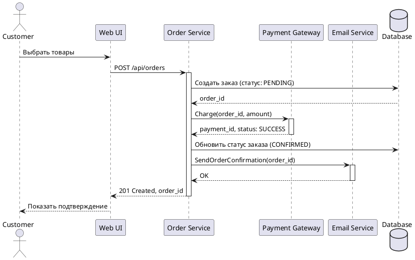

# Лабораторная работа №1. Сценарий транзакции

**Дисциплина:** Проектирование интернет-систем  
**Тема:** Моделирование use-case и границ ответственности

---

> 🚀 **Впервые здесь?** Начните с [QUICK_START.md](QUICK_START.md) — пошаговая инструкция по настройке инструментов и быстрому старту!

---

## Цель работы

Научиться анализировать бизнес-процессы интернет-системы, выявлять границы ответственности компонентов и моделировать транзакционные сценарии с учётом возможных сбоев.

## Результаты обучения

После выполнения работы студент будет:
- Уметь декомпозировать бизнес-процесс на шаги и определять акторов
- Понимать транзакционные границы и точки отказа
- Строить диаграммы последовательности (sequence diagrams)
- Описывать сценарии в нотации Gherkin (Given-When-Then)
- Анализировать граничные случаи и механизмы восстановления

## Теоретическая справка

### Что такое транзакционный сценарий?

**Транзакция** — последовательность операций, которая должна быть выполнена полностью (commit) или не выполнена вообще (rollback). В интернет-системах транзакция может затрагивать несколько компонентов и внешних сервисов.

**Use-case** (вариант использования) — описание взаимодействия пользователя с системой для достижения конкретной цели.

### Акторы

- **Первичный актор** — инициирует сценарий (например, Покупатель)
- **Вторичные акторы** — внешние системы, с которыми взаимодействует приложение (Платёжный шлюз, Служба доставки)

### Граничные условия

- **Happy path** — идеальный сценарий без ошибок
- **Альтернативные потоки** — варианты при выборе пользователя (отмена, изменение данных)
- **Исключительные ситуации** — ошибки (нет товара на складе, сбой оплаты, таймаут внешнего API)

### Точки отказа

- Недоступность внешнего сервиса (payment gateway, email)
- Нарушение инвариантов (недостаточно товара, некорректные данные)
- Сетевые сбои (timeout, connection refused)
- Конкурентный доступ (race condition при резервировании последнего товара)

---

## Требуемые инструменты и настройка VS Code

### Обязательные инструменты

Для выполнения лабораторной работы необходимо установить:

1. **Git** — для работы с репозиторием
   - Windows: https://git-scm.com/download/win
   - Проверка: `git --version`

2. **Visual Studio Code** — редактор кода
   - Скачать: https://code.visualstudio.com/

3. **Java Runtime Environment (JRE)** — для работы PlantUML
   - Скачать: https://www.oracle.com/java/technologies/downloads/
   - Или OpenJDK: https://adoptium.net/
   - Проверка: `java -version`

### Расширения VS Code (обязательные)

Установите следующие расширения в VS Code (`Ctrl+Shift+X`):

#### 1. PlantUML (`jebbs.plantuml`)

**Для чего:** Создание и экспорт диаграмм последовательности

**Установка:**
```
1. Ctrl+Shift+X → найти "PlantUML"
2. Установить расширение от jebbs
3. Перезагрузить VS Code
```

**Использование:**
- Создать файл `.puml` (например, `sequence-happy.puml`)
- `Alt+D` — предпросмотр диаграммы
- `Ctrl+Shift+P` → "PlantUML: Export Current Diagram" → выбрать PNG

**Проверка:** Откройте любой `.puml` файл из [examples/diagrams/](examples/diagrams/) и нажмите `Alt+D`

#### 2. Cucumber (Gherkin) Full Support (`alexkrechik.cucumberautocomplete`)

**Для чего:** Подсветка синтаксиса и автодополнение для `.feature` файлов

**Установка:**
```
1. Ctrl+Shift+X → найти "Cucumber"
2. Установить "Cucumber (Gherkin) Full Support"
```

**Использование:**
- Откройте `.feature` файл
- Автоматическая подсветка `Given`, `When`, `Then`
- Автодополнение ключевых слов

#### 3. Markdown All in One (`yzhang.markdown-all-in-one`)

**Для чего:** Удобная работа с Markdown файлами (отчёты, README)

**Установка:**
```
1. Ctrl+Shift+X → найти "Markdown All in One"
2. Установить расширение от Yu Zhang
```

**Функции:**
- `Ctrl+Shift+V` — предпросмотр Markdown
- Автосоздание оглавления
- Форматирование таблиц

### Дополнительные расширения (опционально)

#### GitLens (`eamodio.gitlens`)
Для удобства работы с Git (просмотр истории, авторство кода)

#### Code Spell Checker Russian (`streetsidesoftware.code-spell-checker-russian`)
Проверка орфографии в русских текстах отчётов

### Альтернативные онлайн-инструменты

Если не получается установить локально:

- **PlantUML Online:** https://www.plantuml.com/plantuml/uml/
- **Mermaid Live Editor:** https://mermaid.live/
- **Draw.io:** https://app.diagrams.net/

### Проверка готовности

Убедитесь, что всё работает:

```bash
# 1. Проверка Git
git --version
# Ожидается: git version 2.x.x

# 2. Проверка Java
java -version
# Ожидается: java version "17.x.x" или выше

# 3. Клонирование репозитория
git clone https://github.com/brstu/PIS-2026.git
cd PIS-2026/labs/01_transaction_scenario/examples/diagrams

# 4. Открытие в VS Code
code .

# 5. Открыть sequence-happy.puml и нажать Alt+D
# Должна отобразиться диаграмма
```

---

## Задание

### Часть 1. Описание use-case (текстовое)

Выберите **основной сценарий** вашей предметной области (варианты см. в [ВАРИАНТЫ_ЛАБОРАТОРНЫХ.md](../../ВАРИАНТЫ_ЛАБОРАТОРНЫХ.md)).

Примеры (выбери свой вариант из [ВАРИАНТЫ_ЛАБОРАТОРНЫХ.md](../../ВАРИАНТЫ_ЛАБОРАТОРНЫХ.md)):
- **Таск-трекер «Не прокрастинируй»**: Создание задачи с назначением
- **Бронь аудиторий «Не занято?»**: Резервирование слота
- **Мини-LMS «Учись, не болей»**: Запись на курс
- **Хэбит-трекер «Я молодец!»**: Отметка выполнения привычки
- **Микро-шоп «Добавь в корзину»**: Оформление заказа

Опишите use-case по шаблону:

```
## Use-case: <Название>

**Первичный актор**: <Кто инициирует>

**Цель**: <Что хочет достичь актор>

**Предусловия**: 
- <Что должно быть выполнено до начала>

**Основной поток** (Happy Path):
1. <Шаг 1>
2. <Шаг 2>
...
n. <Шаг N>

**Постусловия**:
- <Что гарантируется после успешного завершения>

**Альтернативные потоки**:
- 3a. <Если пользователь выбрал вариант X>
  - 3a1. <Действие системы>
  - 3a2. Возврат к шагу 4

**Исключительные ситуации**:
- 5a. <Если произошла ошибка Y>
  - 5a1. Система откатывает транзакцию
  - 5a2. Система уведомляет пользователя
  - 5a3. Use-case завершается неудачей
```

### Часть 2. Диаграмма последовательности (Sequence Diagram)

Постройте диаграмму для **основного потока** (happy path).

Включите:
- Актора (пользователя)
- Основные компоненты системы (UI, API, БД)
- Внешние сервисы (Payment, Email, Delivery)

**Инструменты** (см. раздел [Требуемые инструменты и настройка VS Code](#требуемые-инструменты-и-настройка-vs-code)):
- **PlantUML** (рекомендуется) — установите плагин для VS Code
- Mermaid — встроенная поддержка в GitHub
- draw.io / Lucidchart — онлайн-редакторы

⚠️ **Важно:** Для работы с PlantUML в VS Code необходимо установить:
1. Java Runtime Environment (JRE)
2. Расширение PlantUML (`jebbs.plantuml`)

**Пример на PlantUML**:



**Требования**:
- Покажите синхронные вызовы (стрелки с заполненным наконечником)
- Покажите асинхронные операции (пунктирные стрелки)
- Укажите активацию компонентов (`activate`/`deactivate`)
- Добавьте комментарии для важных шагов

### Часть 3. Сценарии в формате Gherkin

Опишите 3-5 сценариев: 1 успешный (happy path) и 2-4 с ошибками.

⚠️ **Рекомендация:** Установите плагин **Cucumber (Gherkin) Full Support** для подсветки синтаксиса в `.feature` файлах (см. [Требуемые инструменты](#требуемые-инструменты-и-настройка-vs-code)).

**Пример для Таск-трекера «Не прокрастинируй» 😎**:

```gherkin
Feature: Создание и назначение задачи

Scenario: Успешное создание задачи с назначением
  Given пользователь авторизован как "anna@example.com" с ролью "Project Manager"
  And проект "Курсовая работа" существует и активен
  And пользователь "ivan@example.com" является участником проекта
  When менеджер создаёт задачу "Написать введение"
  And устанавливает дедлайн "2026-03-15"
  And назначает задачу на "ivan@example.com"
  And добавляет метку "high-priority"
  Then система создаёт задачу с ID "TASK-42" и статусом "TODO"
  And система публикует событие "TaskCreated"
  And система отправляет уведомление на "ivan@example.com"
  And пользователь видит сообщение "Задача #TASK-42 успешно создана и назначена"

Scenario: Ошибка — дедлайн в прошлом (кто-то опоздал... 😅)
  Given пользователь авторизован как "anna@example.com"
  And проект "Курсовая работа" существует
  When менеджер создаёт задачу "Исправить баги"
  And устанавливает дедлайн "2024-01-01" (это же прошлый год!)
  Then система возвращает ошибку "Дедлайн не может быть в прошлом"
  And задача НЕ создаётся
  And пользователь видит сообщение "Машину времени ещё не изобрели. Выбери дату из будущего! ⏰"

Scenario: Исполнитель не найден (назначили на того, кого нет)
  Given пользователь авторизован как "anna@example.com"
  And проект "Курсовая работа" существует
  When менеджер создаёт задачу "Сделать презентацию"
  And пытается назначить на "ghost@example.com" (такого юзера не существует)
  Then система возвращает ошибку "Пользователь не найден"
  And система НЕ создаёт задачу
  And пользователь видит сообщение "Этот человек не найден. Проверь email!"

Scenario: Таймаут сервиса уведомлений (Email-сервис лёг)
  Given пользователь авторизован как "anna@example.com"
  And проект "Курсовая работа" существует
  And пользователь "ivan@example.com" является участником
  When менеджер создаёт задачу "Подготовить данные"
  And назначает задачу на "ivan@example.com"
  And сервис уведомлений не отвечает в течение 10 секунд
  Then система создаёт задачу со статусом "TODO"
  And система ставит уведомление в очередь для повторной отправки
  And пользователь видит сообщение "Задача создана! Уведомление будет отправлено позже."
  And в логах фиксируется "NotificationService timeout, task queued for retry"
```

### Часть 4. Анализ границ ответственности

Определите **транзакционные границы** и **компенсирующие действия**.

**Вопросы для анализа**:

1. **Где начинается и заканчивается транзакция?**
   - Пример: Транзакция начинается при нажатии "Оформить заказ" и заканчивается отправкой email-подтверждения

2. **Какие операции должны быть атомарными?**
   - Пример: Создание заказа + резервирование товара на складе (в одной БД-транзакции)

3. **Какие операции могут быть асинхронными?**
   - Пример: Отправка email может быть отложена (eventual consistency)

4. **Что делать при отказе внешнего сервиса?**
   - Платёжный шлюз недоступен → retry с экспоненциальной задержкой (1s, 2s, 4s, ...)
   - Email-сервис недоступен → поместить задачу в очередь для отложенной отправки

5. **Как обеспечить идемпотентность?**
   - Пример: Если пользователь дважды нажал "Оплатить", не создавать дубликат заказа
   - Решение: Проверять `idempotency_key` или статус существующего заказа

**Оформите результаты в таблице**:

| Операция | Синхронная/Асинхронная | Откат при ошибке | Retry-стратегия | Идемпотентность |
|----------|------------------------|------------------|-----------------|-----------------|
| Создание заказа в БД | Синхронная | Да (ROLLBACK) | Нет (контролируется БД) | Да (проверка дублей по email+timestamp) |
| Резервирование товара | Синхронная | Да (в той же транзакции) | Нет | Да |
| Вызов Payment Gateway | Синхронная | Да (отмена заказа) | 3 попытки с задержкой 2s | Да (payment_intent_id) |
| Отправка email | Асинхронная | Нет (best-effort) | 5 попыток с exp. backoff | Да (дедупликация по order_id) |

### Часть 5. Обработка исключительных ситуаций

Для каждой исключительной ситуации опишите:

1. **Условие возникновения**
2. **Обнаружение** (как система узнаёт об ошибке)
3. **Реакция** (что делает система)
4. **Компенсация** (как откатить частично выполненные действия)
5. **Уведомление пользователя**

**Пример**:

```markdown
### Исключительная ситуация: Таймаут платёжного шлюза

**Условие**: Платёжный шлюз не ответил в течение 30 секунд

**Обнаружение**: 
- HTTP-клиент выбрасывает TimeoutException
- Система логирует событие: "Payment timeout for order_id=12345"

**Реакция**:
1. Система НЕ откатывает заказ сразу (возможно, платёж пройдёт позже)
2. Заказ переводится в статус "PAYMENT_PENDING"
3. Запускается фоновое задание для проверки статуса платежа

**Компенсация**:
- Если через 10 минут платёж не подтверждён → отменить заказ
- Освободить зарезервированный товар на складе

**Уведомление пользователя**:
- Немедленно: "Обработка платежа задерживается..."
- Через 10 минут (если не подтверждено): "Заказ отменён из-за неудачной оплаты"
```

<!-- START:artifacts -->
## Структура отчёта

📄 **[Макет отчёта для заполнения →](Макет_отчета.md)**

Создайте в **своём репозитории** папку `lab-01/` со следующей структурой:

```
lab-01/
├── Отчет.md                # Заполненный макет отчёта (скопируйте Макет_отчета.md)
├── use-case.md             # Текстовое описание use-case
├── diagrams/
│   ├── sequence-happy.puml # PlantUML для успешного сценария
│   ├── sequence-happy.png  # Экспорт диаграммы
│   ├── sequence-error-payment.puml
│   └── sequence-error-payment.png
├── scenarios.feature       # Gherkin-сценарии
└── analysis.md             # Анализ границ ответственности
```

**Как заполнить отчёт:**
1. Скопируйте [Макет_отчета.md](Макет_отчета.md) в свой репозиторий как `Отчет.md`
2. Замените все плейсхолдеры (в `_[квадратных скобках]_`) на свои данные
3. Заполните таблицы критериев (замените ❌ на ✅)
4. Вставьте скриншоты диаграмм
5. Напишите выводы
<!-- END:artifacts -->
<!-- END:artifacts -->

<!-- START:criteria -->
## Критерии оценки

| Критерий | Баллы | Требования |
|----------|-------|------------|
| Use-case описание | 15 | Полнота: акторы, предусловия, основной поток, альтернативы, исключения |
| Sequence diagram (happy path) | 20 | Корректность нотации UML, включение всех ключевых компонентов |
| Sequence diagram (error case) | 15 | Моделирование хотя бы одной исключительной ситуации |
| Gherkin-сценарии | 20 | Минимум 4 сценария (1 успешный + 3 ошибочных) |
| Анализ границ ответственности | 15 | Таблица транзакционных границ, обоснование выбора синхронных/асинхронных операций |
| Обработка исключений | 10 | Описание стратегий retry, компенсации, уведомлений |
| Качество документации | 5 | Оформление, читаемость, грамотность |
| **ИТОГО** | **100** | |
<!-- END:criteria -->

<!-- START:bonuses -->
## Бонусы (+ до 15)

* **Saga pattern** (+5) — моделирование компенсирующих транзакций с диаграммой для отката распределённых операций
* **Idempotency pattern** (+3) — реализация механизма идемпотентности с примерами (idempotency_key, дедупликация)
* **Circuit Breaker** (+4) — описание и диаграмма паттерна для защиты от cascade failures внешних сервисов
* **Event Sourcing** (+3) — моделирование журнала событий для аудита и восстановления состояния транзакций
* **Race Conditions** (+5) — анализ конкурентного доступа (pessimistic/optimistic locking) с примерами сценариев
<!-- END:bonuses -->

## Контрольные вопросы для защиты

1. Что такое транзакционная граница? Где она проходит в вашем сценарии?
2. Почему операция X выбрана синхронной, а Y — асинхронной?
3. Как обеспечить идемпотентность при повторных запросах?
4. Что произойдёт, если платёжный шлюз вернёт ошибку после списания средств?
5. Как система обнаружит, что внешний сервис недоступен?
6. Какие данные нужно логировать для диагностики сбоев?
7. Как изменится сценарий, если добавить функцию "Отложенная оплата"?

## Полезные ресурсы
### 🚀 Быстрый старт
- **[QUICK_START.md](QUICK_START.md)** — пошаговая инструкция для новичков (настройка + первые шаги)
### �️ Настройка инструментов
- **[Требуемые инструменты и настройка VS Code](#требуемые-инструменты-и-настройка-vs-code)** — что установить перед началом работы
- **[PlantUML плагин для VS Code](https://marketplace.visualstudio.com/items?itemName=jebbs.plantuml)** — для создания диаграмм
- **[Cucumber плагин для VS Code](https://marketplace.visualstudio.com/items?itemName=alexkrechik.cucumberautocomplete)** — для Gherkin-сценариев
- **[Java Runtime Environment (JRE)](https://adoptium.net/)** — необходим для PlantUML

### �📖 Документация и примеры
- **[Макет отчёта](Макет_отчета.md)** — шаблон для заполнения
- **[Примеры выполнения](examples/)** — готовые артефакты для варианта "Поисково-спасательный отряд Юго-Запад"
  - [use-case.md](examples/use-case.md) — детальное описание сценария
  - [scenarios.feature](examples/scenarios.feature) — 14 Gherkin-сценариев
  - [analysis.md](examples/analysis.md) — анализ транзакционных границ
  - [diagrams/](examples/diagrams/) — PlantUML диаграммы (happy path + error case)
    - [sequence-happy.puml](examples/diagrams/sequence-happy.puml)
    - [sequence-error-notification.puml](examples/diagrams/sequence-error-notification.puml)

### 🔗 Внешние ресурсы
- [PlantUML Sequence Diagram](https://plantuml.com/sequence-diagram)
- [Cucumber Gherkin Syntax](https://cucumber.io/docs/gherkin/reference/)
- [Martin Fowler: Sagas](https://martinfowler.com/articles/patterns-of-distributed-systems/saga.html)
- [Enterprise Integration Patterns](https://www.enterpriseintegrationpatterns.com/)

## Срок сдачи

**Неделя 2-3 семестра**  
Защита: очная, с ответами на контрольные вопросы
